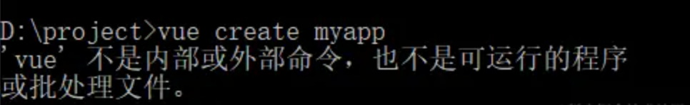
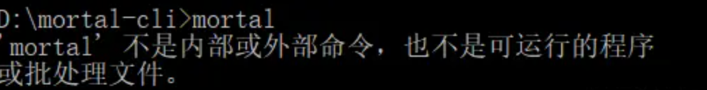
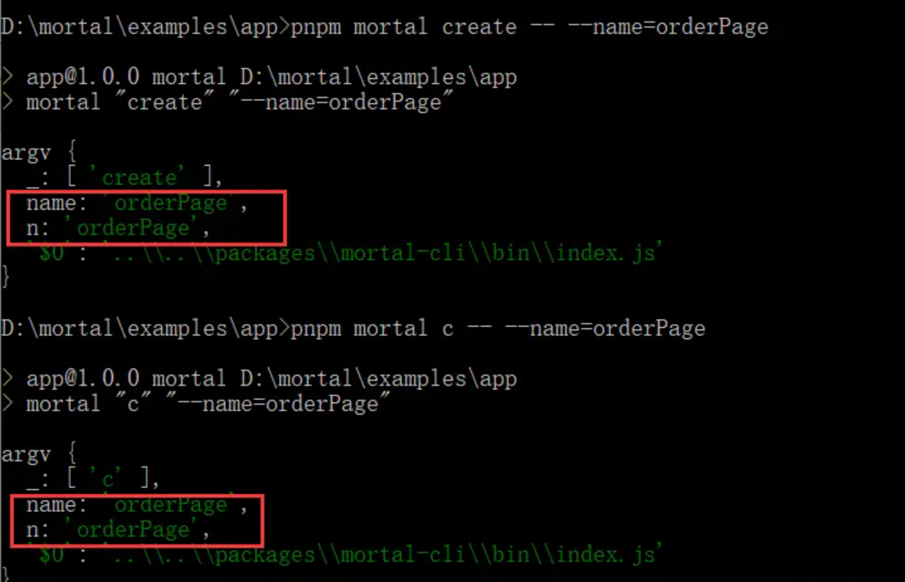
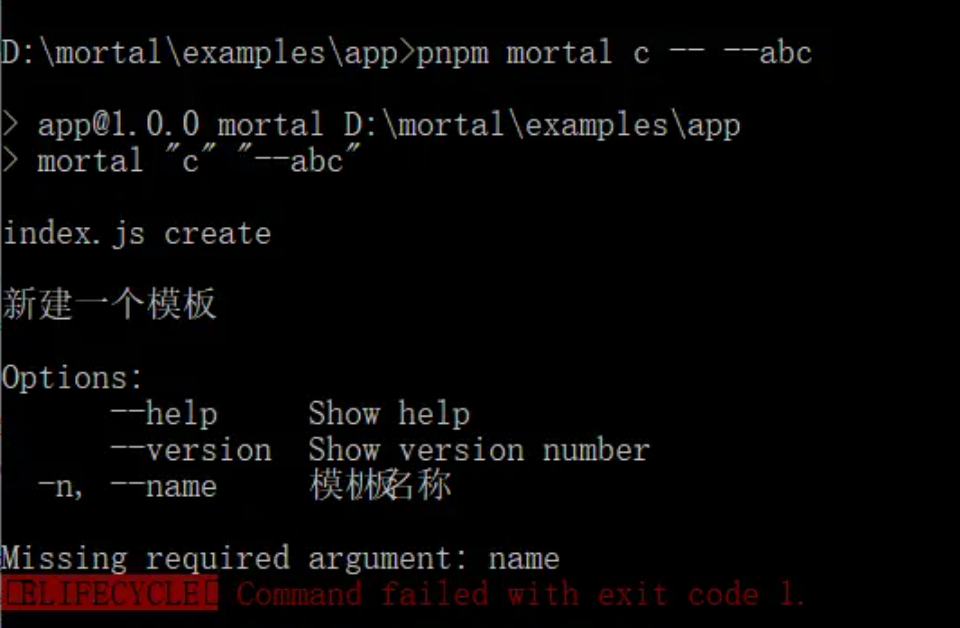
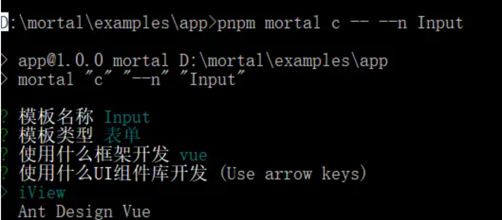
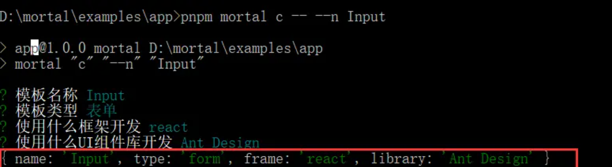

# 前端脚手架搭建

如果你熟悉 `Vue` , 肯定对 `vue-cli` 这个脚手架有一定了解，比如运行 `vue create myapp` 命令来创建一个 `Vue` 工程。
如果我们没有运行 `npm install -g vue-cli` 安装 `vue-cli` 脚手架，在命令行窗口中直接运行 `vue create myapp`，会报错，报错如下图所示：


可见 `vue` 不是系统命令， `vue` 只是 `vue-cli` 脚手架声明的一个命令。

那怎么给脚手架声明一个命令，其实非常简单，跟我来操作。

## 项目初始化

1. 创建一个名为`mortal-cli`的文件夹
2. 运行命令`pnpm init` 初始化一个`package.json`配置文件
3. 在`package.json`中添加`bin`节点

```json
{
  "name": "mortal-cli",
  "version": "1.0.0",
  "description": "",
  "main": "index.js",
  "scripts": {
    "test": "echo \"Error: no test specified\" && exit 1"
  },
  "author": "",
  "license": "ISC",
  "bin": {
    "mortal": "./bin/index.js"
  }
}
```

这样我们就声明了一个 `mortal` 的命令，另外 `./bin/index.js` 是运行 `mortal` 命令后会运行的 `js` 文件的相对路径。
接着我们在 `mortal-cli` 的文件夹中创建一个 `bin` 文件夹，在 `bin` 文件夹中创建一个 `index.js` 文件，并在该文件中添加如下代码：

```bash
#!/usr/bin/env node

console.log('Welcome to Mortal World');

```

:::warning
注意在文件头部添加 `#!/usr/bin/env node`，否则运行后会报错！！！
:::

## npm link

上面我们完成了一个最基础的脚手架工程，接下来在命令行窗口输入 `mortal` 命令，运行该命令。

会发现，还是报错，提示 `mortal` 命令不是系统命令，当然不是声明命令的方法错误。

假如你把这个脚手架发布到 `npm` 上后。由于 `mortal-cli/pakeage.json` 中 `name` 的值为 `mortal-cli`，所以我们运行 `npm install -g mortal-cli` 将脚手架安装到本地后，再运行 `mortal` 命令，就会发现运行成功。

在实际开发脚手架过程中不可能这么做，因为你不可能改动一行代码就发布到`npm`上面，所以我们还要实现本地调试脚手架的能力，实现起来也非常简单，一个命令搞定。
这个命令就是 `npm link`，这个命令会在本地生成一个软链接，效果就和`npm install -g mortal-cli`一致。

如果需要删除软链接，运行 `npm unlink mortal` 即可

## 命令行参数获取

1. 使用`node`内置模块获取

在`bin/index.js`写入代码

```js
const process = require("process");
// 获取命令参数
console.log(process.argv);
```

运行`mortal --name=orderPage`，即可看到参数。

如果通过 `process.argv` 来获取，要额外处理两种不同的命令参数格式，不方便。

2. 通过`yargs`获取参数
   安装依赖 `pnpm add yargs`

在 `bin/index.js` 添加如下代码：

```js
const yargs = require("yargs");
// 获取参数
console.log("name", yargs.argv.name);
```

可以通过 `yargs.argv.name` 直接获取命令参数 `name` 的值。
:::warning
注意，以上代码是在 Node.js 环境中运行，Node.js 的模块是遵循 CommonJS 规范的，如果要依赖一个模块，要使用 Node.js 内置 require 系统函数引用模块使用。
:::

## 设置子命令

假如脚手架要对外提供多个功能，不能将所有的功能都集中在 `mortal` 命令中实现。
可以通过 `yargs` 提供的 `command` 方法来设置一些子命令，让每个子命令对应各自功能，各司其职。
`yargs.command` 的用法是 `yargs.command(cmd, desc, builder, handler)`。

- cmd：字符串，子命令名称，也可以传递数组，如 `['create', 'c']`，表示子命令叫 `create`，其别名是 `c`；
- desc：字符串，子命令描述信息；
- builder：一个返回数组的函数，子命令参数信息配置，比如可以设置参数：

  - alias：别名；
  - demand：是否必填；
  - default：默认值；
  - describe：描述信息；
  - type：参数类型，string | boolean | number。

- handler: 函数，可以在这个函数中专门处理该子命令参数。

下面我们来设置一个用来生成一个模板的子命令，把这个子命令命名为 create。

修改在 `bin/index.js` 文件中的代码，如下所示：

```js
#!/usr/bin/env node

const yargs = require("yargs");
yargs.command(
  ["create", "c"],
  "新建一个模板",
  function (yargs) {
    return yargs.option("name", {
      alias: "n",
      demand: true,
      describe: "模板名称",
      type: "string",
    });
  },
  function (argv) {
    console.log("argv", argv);
  }
).argv;
```

分别运行 `pnpm mortal create --name=orderPage` 和 `pnpm mortal c --name=orderPage` 命令。

运行后会发现，参数正常打印。

如果运行`pnpm mortal c --abc` 控制台会进行错误提示。


## 用户交互模块

我认为比较好的用户交互方式是讯问式的交互，比如我们在运行 `npm init`，通过询问式的交互完成 `package.json` 文件内容的填充。

这里推荐使用 `inquirer` 开源库来实现询问式的交互，运行以下命令安装 `inquirer`

```bash
pnpm add inquirer@8.2.5
```

为了使用 `require` 引入 `inquirer` ，要使用 `8.2.5` 版本的 `inquirer`。

这里我们主要使用了 inquirer 开源库的三个方面的能力：

- 询问用户问题
- 获取并解析用户的输入
- 检测用户的答案是否合法

主要通过 `inquirer.prompt()` 来实现。`prompt` 函数接收一个数组，数组的每一项都是一个询问项，询问项有很多配置参数，下面是常用的配置项。

- type：提问的类型，常用的有

  - 输入框：input；
  - 确认：confirm；
  - 单选组：list；
  - 多选组：checkbox；

- name：存储当前问题答案的变量；
- message：问题的描述；
- default：默认值；
- choices：列表选项，在某些 type 下可用；
- validate：对用户的答案进行校验；
- filter：对用户的答案进行过滤处理，返回处理后的值。

比如我们创建一个模板文件，大概会询问用户：模板文件名称、模板类型、使用什么框架开发、使用框架对应的哪个组件库开发等等。下面我们来实现这个功能。

在 `bin` 文件夹中新建 `inquirer.js` 文件夹，在里面添加如下代码：

```js
const inquirer = require("inquirer");

function inquirerPrompt(argv) {
  const { name } = argv;
  return new Promise((resolve, reject) => {
    inquirer
      .prompt([
        {
          type: "input",
          name: "name",
          message: "模板名称",
          default: name,
          validate: function (val) {
            if (!/^[a-zA-Z]+$/.test(val)) {
              return "模板名称只能含有英文";
            }
            if (!/^[A-Z]/.test(val)) {
              return "模板名称首字母必须大写";
            }
            return true;
          },
        },
        {
          type: "list",
          name: "type",
          message: "模板类型",
          choices: ["表单", "动态表单", "嵌套表单"],
          filter: function (value) {
            return {
              表单: "form",
              动态表单: "dynamicForm",
              嵌套表单: "nestedForm",
            }[value];
          },
        },
        {
          type: "list",
          message: "使用什么框架开发",
          choices: ["react", "vue"],
          name: "frame",
        },
      ])
      .then((answers) => {
        const { frame } = answers;
        if (frame === "react") {
          inquirer
            .prompt([
              {
                type: "list",
                message: "使用什么UI组件库开发",
                choices: ["Ant Design"],
                name: "library",
              },
            ])
            .then((answers1) => {
              resolve({
                ...answers,
                ...answers1,
              });
            })
            .catch((error) => {
              reject(error);
            });
        }

        if (frame === "vue") {
          inquirer
            .prompt([
              {
                type: "list",
                message: "使用什么UI组件库开发",
                choices: ["Element"],
                name: "library",
              },
            ])
            .then((answers2) => {
              resolve({
                ...answers,
                ...answers2,
              });
            })
            .catch((error) => {
              reject(error);
            });
        }
      })
      .catch((error) => {
        reject(error);
      });
  });
}

exports.inquirerPrompt = inquirerPrompt;
```

其中 `inquirer.prompt()` 返回的是一个 `Promise`，我们可以用 `then` 获取上个询问的答案，根据答案再发起对应的内容。

在 `bin/index.js` 中引入 `inquirerPrompt` 。

```js
#!/usr/bin/env node

const yargs = require("yargs");
const { inquirerPrompt } = require("./inquirer");

yargs.command(
  ["create", "c"],
  "新建一个模板",
  function (yargs) {
    return yargs.option("name", {
      alias: "n",
      demand: true,
      describe: "模板名称",
      type: "string",
    });
  },
  function (argv) {
    inquirerPrompt(argv).then((answers) => {
      console.log(answers);
    });
  }
).argv;
```

在 `app` 文件夹目录下运行 `pnpm mortal c --n Input` 命令，执行结果如下图所示：

回答完成后，可以在下图中清楚地看到答案格式


## 文件夹拷贝模块

要生成一个模板文件，最简单的做法就是执行脚手架提供的命令后，把脚手架中的模板文件，拷贝到对应的地方。模板文件可以是单个文件，也可以是一个文件夹。本小节先介绍一下模板文件是文件夹时候如何拷贝。

在 `Node.js` 中拷贝文件夹并不简单，需要用到递归，这里推荐使用开源库`copy-dir`来实现拷贝文件。

运行以下命令安装 `copy-dir` 。

```bash
pnpm add copy-dir
```

在 `bin` 文件夹中新建 `copy.js` 文件，在里面添加如下代码：

```js
const copydir = require("copy-dir");
const fs = require("fs");
const path = require("path");

function mkdirGuard(target) {
  try {
    // recursive: true 支持创建多级目录
    fs.mkdirSync(target, { recursive: true });
  } catch (e) {
    /**
     * 容错处理 如果上面的mkdirSync出错了，则递归创建目录
     **/
    mkdirp(target);
    function mkdirp(dir) {
      if (fs.existsSync(dir)) {
        return true;
      }
      const dirname = path.dirname(dir);
      mkdirp(dirname);
      fs.mkdirSync(dir);
    }
  }
}

function copyDir(form, to, options) {
  mkdirGuard(to);
  copydir.sync(form, to, options);
}

function checkMkdirExists(path) {
  return fs.existsSync(path);
}

exports.checkMkdirExists = checkMkdirExists;
exports.mkdirGuard = mkdirGuard;
exports.copyDir = copyDir;
```

在 `bin/index.js` 修改代码，修改后的代码如下所示：

```js
#!/usr/bin/env node

const yargs = require("yargs");
const path = require("path");
const { inquirerPrompt } = require("./inquirer");
const { copyDir, checkMkdirExists } = require("./copy");

yargs.command(
  ["create", "c"],
  "新建一个模板",
  function (yargs) {
    return yargs.option("name", {
      alias: "n",
      demand: true,
      describe: "模板名称",
      type: "string",
    });
  },
  function (argv) {
    inquirerPrompt(argv).then((answers) => {
      const { name, type } = answers;
      const isMkdirExists = checkMkdirExists(
        path.resolve(process.cwd(), `./src/pages/${name}`)
      );
      if (isMkdirExists) {
        console.log(`${name}文件夹已经存在`);
      } else {
        copyDir(
          path.resolve(__dirname, `./template/${type}`),
          path.resolve(process.cwd(), `./src/pages/${name}`)
        );
      }
    });
  }
).argv;
```

`process.cwd()` 当前`Node.js` 进程执行时的文件所属目录的绝对路径。比如在 `bin` 文件夹目录下运行 `node index.js` 时，`process.cwd()`得到的是 `D:\mortal\packages\mortal-cli\bin`

## 文件拷贝模块

文件拷贝分三步来实现，使用 `fs.readFileSync` 读取被拷贝的文件内容，然后创建一个文件，再使用 `fs.writeFileSync` 写入文件内容。

在 `bin/copy.js` 文件，在里面添加如下代码：

```js
function copyFile(from, to) {
  const buffer = fs.readFileSync(from);
  const parentPath = path.dirname(to);

  mkdirGuard(parentPath);

  fs.writeFileSync(to, buffer);
}

exports.copyFile = copyFile;
```

接下来我们使用 `copyFile` 方法，在 `bin/index.js` 修改代码，修改后的代码如下所示：

```js
#!/usr/bin/env node

const yargs = require("yargs");
const path = require("path");
const { inquirerPrompt } = require("./inquirer");
const { copyDir } = require("./copy");

yargs.command(
  ["create", "c"],
  "新建一个模板",
  function (yargs) {
    return yargs.option("name", {
      alias: "n",
      demand: true,
      describe: "模板名称",
      type: "string",
    });
  },
  function (argv) {
    inquirerPrompt(argv).then((answers) => {
      const { name, type } = answers;
      const isMkdirExists = checkMkdirExists(
        path.resolve(process.cwd(), `./src/pages/${name}/index.js`)
      );
      if (isMkdirExists) {
        console.log(`${name}/index.js文件已经存在`);
      } else {
        copyFile(
          path.resolve(__dirname, `./template/${type}/index.js`),
          path.resolve(process.cwd(), `./src/pages/${name}/index.js`)
        );
      }
    });
  }
).argv;
```

`copyFile` 和 `copyDir` 使用的区别在参数，`copyFile` 要求参数 `from` 和参数 `to` 都精确到文件路径。

## 动态文件生成模块

假设脚手架中提供的模板文件中某些信息需要根据用户输入的命令参数来动态生成对应的模板文件。

比如模板中 `package.json`的 `name`字段要动态替换成用户输入的命令参数 `name` 的值，该如何实现呢？

这里推荐使用开源库 mustache 来实现，运行以下命令安装 mustache 。

```bash
pnpm add mustache --F mortal-cli
```

我们在创建一个 `package.json.tpl` 文件，内容如下：

```json
{
  "name": "{{name}}",
  "version": "1.0.0",
  "description": "脚手架",
  "main": "index.js",
  "scripts": {
    "test": "echo \"Error: no test specified\" && exit 1"
  },
  "keywords": [],
  "author": "",
  "license": "ISC",
  "bin": {
    "bbkb-cli": "./bin/index.js"
  }
}
```

实现一个 `readTemplate` 方法来读取这个 `package.json.tpl` 动态模板文件内容。在 `bin/copy.js` 文件，在里面添加如下代码：

```js
const Mustache = require("mustache");

function readTemplate(path, data = {}) {
  const str = fs.readFileSync(path, { encoding: "utf8" });
  return Mustache.render(str, data);
}

exports.readTemplate = readTemplate;
```

`readTemplate` 方法接收两个参数，`path` 动态模板文件的相对路径，`data` 动态模板文件的配置数据。
使用 `Mustache.render(str, data)` 生成模板文件内容返回，因为 `Mustache.render` 的第一个参数类型是个字符串，所以在调用 `fs.readFileSync` 时要指定 `encoding` 类型为 `utf8`，否则 `fs.readFileSync` 返回 `Buffer` 类型数据。

再写一个 `copyTemplate` 方法来拷贝模板文件到对应的地方，跟 `copyFile` 方法非常相似。在 `bin/copy.js` 文件，在里面添加如下代码：

```js
function copyTemplate(from, to, data = {}) {
  if (path.extname(from) !== ".tpl") {
    return copyFile(from, to);
  }
  const parentToPath = path.dirname(to);
  mkdirGuard(parentToPath);
  fs.writeFileSync(to, readTemplate(from, data));
}
```

`path.extname(from)` 返回文件扩展名，比如 `path.extname(index.tpl)` 返回 `.tpl`。

在 `bin/index.js` 修改代码，修改后的代码如下所示：

```js
#!/usr/bin/env node

const yargs = require("yargs");
const path = require("path");
const { inquirerPrompt } = require("./inquirer");
const { copyTemplate } = require("./copy");

yargs.command(
  ["create", "c"],
  "新建一个模板",
  function (yargs) {
    return yargs.option("name", {
      alias: "n",
      demand: true,
      describe: "模板名称",
      type: "string",
    });
  },
  function (argv) {
    inquirerPrompt(argv).then((answers) => {
      const { name, type } = answers;
      const isMkdirExists = checkMkdirExists(
        path.resolve(process.cwd(), `./package.json`)
      );
      if (isMkdirExists) {
        console.log(`package.json文件已经存在`);
      } else {
        copyTemplate(
          path.resolve(__dirname, `./package.json.tpl`),
          path.resolve(process.cwd(), `./package.json`),
          {
            name,
          }
        );
      }
    });
  }
).argv;
```

这样就能将`package.json`中的`name`字段动态替换成用户输入的命令参数 `name` 的值了。

## mustache 简介

以上的案例是 mustache 最简单的使用，下面来额外介绍一些常用的使用场景。

首先来熟悉一下 mustache 的语法，下面来介绍一些场景来使用这些语法

### 简单绑定

使用 `{{key}}` 语法，`key` 要和 `Mustache.render` 方法中的第二个参数（一个对象）的属性名一致。

例如：

```js
Mustache.render("<span>{{name}}</span>", { name: "张三" });
// 输出 <span>张三</span>
```

### 绑定子属性

```js
Mustache.render("<span>{{ifno.name}}</span>", { ifno: { name: "张三" } });
// 输出 <span>张三</span>
```

### 循环渲染

如果 `key` 属性值是一个数组，则可以使用 `#key /key` 语法来循环展示。 其中 `#` 标记表示从该标记以后的内容全部都要循环展示，`/`标记表示循环结束。

例如：

```js
Mustache.render("<span>{{#list}}{{name}}{{/list}}</span>", {
  list: [{ name: "张三" }, { name: "李四" }, { name: "王五" }],
});
// 输出 <span>张三李四王五</span>
```

### 循环中二次处理数据

`Mustache.render` 方法中的第二个参数是个对象，其属性值可以是一个函数，渲染时候会执行函数输出返回值，函数中可以用 `this` 获取第二个参数的上下文。

例如：

```js
Mustache.render("<span>{{#list}}{{info}}{{/list}}</span>", {
  list: [{ name: "张三" }, { name: "李四" }, { name: "王五" }],
  info() {
    return this.name + ",";
  },
});
// 输出 <span>张三,李四,王五,</span>
```

### 条件渲染

使用 `#key` `/key` 语法 和 `^key` `/key` 语法来实现条件渲染，当 `key` 为 `false、0、[]、{}、null`，既是 `key` == `false` 为真，`#key` `/key` 包裹的内容不渲染，`^key` `/key` 包裹的内容渲染

例如：

```js
Mustache.render("<span>{{#show}}显示{{/show}}{{^show}}隐藏{{/show}}</span>", {
  show: false,
});
// 输出 <span>隐藏</span>
```

### 不转义 HTML 标签

使用 `&key` 语法来实现。

```js
Mustache.render("<span>{{&key}}</span>", {
  key: "<span>标题</span>",
});
// 输出 <span><span>标题</span></span>
```

## 自动安装依赖模块

假设模板是这样的：

```jsx
import React from "react";
import { Button, Form, Input } from "antd";

const App = () => {
  const onFinish = (values) => {
    console.log("Success:", values);
  };
  return (
    <Form onFinish={onFinish} autoComplete="off">
      <Form.Item label="Username" name="username">
        <Input />
      </Form.Item>
      <Form.Item>
        <Button type="primary" htmlType="submit">
          提交
        </Button>
      </Form.Item>
    </Form>
  );
};
export default App;
```

可以看到模板中使用了 `react` 和 `antd` 这两个第三方依赖，假如使用模板的工程中没有安装这两个依赖，我们要实现在生成模板过程中就自动安装这两个依赖。
我们使用 `Node` 中 `child_process` 子进程这个模块来实现。

在 `child_process` 子进程中的最常用的语法是：`child_process.exec(command, options, callback)`

- command：命令，比如 pnpm install
- options：参数

  - cwd：设置命令运行环境的路径
  - env：环境变量
  - timeout：运行执行现在

- callback：运行命令结束回调，(error, stdout, stderr) =>{ }，执行成功后 error 为 null，执行失败后 error 为 Error 实例，stdout、stderr 为标准输出、标准错误，其格式默认是字符串。

在 `bin` 文件夹中新建 `manager.js` 文件，在里面添加如下代码：

```js
const path = require("path");
const { exec } = require("child_process");

const LibraryMap = {
  "Ant Design": "antd",
  iView: "view-ui-plus",
  "Ant Design Vue": "ant-design-vue",
  Element: "element-plus",
};

function install(cmdPath, options) {
  const { frame, library } = options;
  const command = `pnpm add ${frame} && pnpm add ${LibraryMap[library]}`;
  return new Promise(function (resolve, reject) {
    exec(
      command,
      {
        cwd: path.resolve(cmdPath),
      },
      function (error, stdout, stderr) {
        console.log("error", error);
        console.log("stdout", stdout);
        console.log("stderr", stderr);
      }
    );
  });
}

exports.install = install;
```

在 `install` 方法中 `exec` 的参数 `command` 是 `pnpm` 安装依赖命令，安装多个依赖时使用 `&&` 拼接。参数 `cwd` 是所安装依赖工程的 `package.json` 文件路径，我们可以使用 `process.cwd()` 获取。已经在上文提到过，`process.cwd()` 是当前`Node.js` 进程执行时的文件所属目录的绝对路径。

接下来使用，在 `bin/index.js`修改代码，修改后的代码如下所示：

```js
#!/usr/bin/env node

const yargs = require("yargs");
const path = require("path");
const { inquirerPrompt } = require("./inquirer");
const { copyTemplate, checkMkdirExists } = require("./copy");
const { install } = require("./manager");

yargs.command(
  ["create", "c"],
  "新建一个模板",
  function (yargs) {
    return yargs.option("name", {
      alias: "n",
      demand: true,
      describe: "模板名称",
      type: "string",
    });
  },
  function (argv) {
    inquirerPrompt(argv).then((answers) => {
      const { name, type } = answers;
      const isMkdirExists = checkMkdirExists(
        path.resolve(process.cwd(), `./src/pages/${name}/index.js`)
      );
      if (isMkdirExists) {
        console.log(`${name}/index.js文件已经存在`);
      } else {
        copyTemplate(
          path.resolve(__dirname, `./template/${type}/index.tpl`),
          path.resolve(process.cwd(), `./src/pages/${name}/index.js`),
          {
            name,
          }
        );
        install(process.cwd(), answers);
      }
    });
  }
).argv;
```

当执行完 `copyTemplate` 方法后，就开始执行 `install(process.cwd(), answers)` 自动安装模板中所需的依赖。

## loading 效果

我们在执行安装依赖命令中会发现，光标一直在闪烁，好像卡住了，其中是依赖在下载中。

这里我们要引入一个加载动画，来解决这个不友好的现象。

这里推荐使用开源库 ora 来实现加载动画。

运行以下命令安装 ora 。

```bash
pnpm add ora@5.4.1
```

在 `bin/manage.js` 修改代码，修改后的代码如下所示：

```js
const path = require("path");
const { exec } = require("child_process");
const ora = require("ora");

const LibraryMap = {
  "Ant Design": "antd",
  iView: "view-ui-plus",
  "Ant Design Vue": "ant-design-vue",
  Element: "element-plus",
};

function install(cmdPath, options) {
  const { frame, library } = options;
  const command = `pnpm add ${frame} && pnpm add ${LibraryMap[library]}`;
  return new Promise(function (resolve, reject) {
    const spinner = ora();
    spinner.start(`正在安装依赖，请稍等`);
    exec(
      command,
      {
        cwd: path.resolve(cmdPath),
      },
      function (error) {
        if (error) {
          reject();
          spinner.fail(`依赖安装失败`);
          return;
        }
        spinner.succeed(`依赖安装成功`);
        resolve();
      }
    );
  });
}

exports.install = install;
```

## 发布和安装

脚手架开发完成之后，就可以[上传到 npm](./发布一个包到npm.md)上面去了，这样别人就可以通过`npm install`进行下载使用了。

```js
pnpm publish
```

发布成功后。我们在一个任意工程中，执行 `pnpm add mortal-cli -D` 安装 `mortal-cli` 脚手架依赖成功后，在工程中执行 `pnpm mortal create --name=my-demo` 命令即可。
