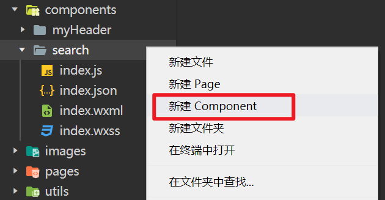

# 自定义组件

## 组件使用步骤

1. 新建组件 `Component`，在新建的组件内写代码。
2. 导入并注册组件，通过 `json` 配置文件的 `usingComponents` 配置项导入并注册。
3. 在页面中使用组件，单标签，双标签写法都可以。

## 新建组件注意事项

1. 组件的 `json` 配置项中会有 `{ "component": true }`。
2. 组件的 `js` 文件入口函数是 `Component({ })`。
3. 不要在 `app.json` 的 `pages` 书写组件的路径，因为这种方式自动生成的 `json` 文件和 `js` 文件是不正确的。



## 页面注册组件 和 全局注册组件

在 页面的 `json` 配置项中注册的组件能提供给单个页面使用，按需注册，性能好。

- 只有 3 个页面用到了搜索框，使用到的页面导入注册即可。

在 全局 `app.json` 配置项注册的组件，所有页面都可使用，使用方便，会占用一定性能。

- 自定义头部组件，多个页面都需要使用到，可以全局注册。

## 插槽 slot

```jsx
// 调用自定义组件的时候传递了一个 icon 组件
<search>
    <icon type="search"/>
</search>

// 自定义组件内部需要通过 slot 插槽接收传递的结构
<view class="search">
  <view class="search_in"><slot></slot>搜索</view>
</view>
```

PS：小程序页支持多个具名插槽 `<slot name="xxx"></slot>` ，须需要添加：` { multipleSlots: true }`。

https://developers.weixin.qq.com/miniprogram/dev/framework/custom-component/wxml-wxss.html#%E7%BB%84%E4%BB%B6%20wxml%20%E7%9A%84%20slot

## 数据父传子

- 父组件通过 `属性` 传递。

```jsx
<myHeader msg="你有新的消息，请注意查收."></myHeader>
<myHeader price="{{ 11 }}"></myHeader>
<myHeader></myHeader>
```

- 子组件通过 `properties` 接收。

```jsx
// components/myHeader/index.js
Component({
  /**
   * 组件的属性列表
   */
  properties: {
    price: Number,          // 简写
    msg: {
      type: String,         // 属性数据类型，如果数据类型不符合规则，小程序自动转换
      value: '默认值'       // 不传递数据时候的默认值
    }
  },
})
```

- 注意事项
  - 小程序子组件接收属性通过 `properties`，等价于 `Vue` 的 `props`。
  - 小程序的 `properties` 的属性必须指定数据类型，❌小程序错误写法 `properties:['price', 'msg']` 。

## 数据子传父

- 父组件通过自定义事件，传递回调函数子组件。

```jsx
// pages/demo10/index.wxml
<view class="title">数据子传父</view>
<sonToFather bind:aaa="bbb"></sonToFather>

// pages/demo10/index.js
Page({
  // 给孩子触发的事件处理函数
  bbb(e){
    const { msg } = e.detail;
    console.log(msg);
    console.log('给孩子触发的事件处理函数',e);
  }
})
```

- 子组件通过  `this.triggerEvent('自定义事件名', 数据)` 触发父组件的自定义事件。

```jsx
<!--components/sonToFather/index.wxml-->
<button bind:tap="ccc">传递数据给父组件</button>

// components/sonToFather/index.js
Component({
  /** 组件的方法列表 */
  methods: {
    ccc(){
      this.triggerEvent('aaa',{msg:'叫爸爸'})
    }
  }
})
```
