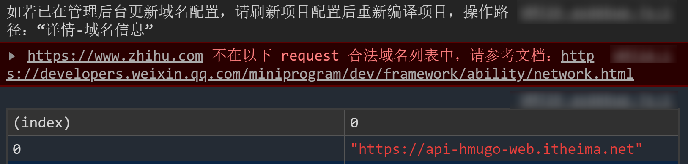
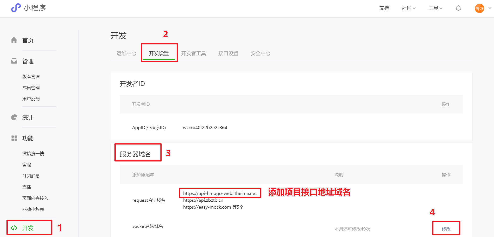
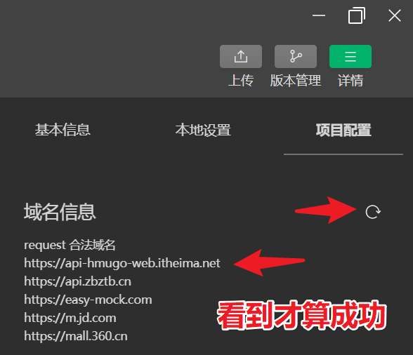

# 小程序端发起网络请求

## 请求三要素

1. 请求方式。`GET`   `POST`   `PUT`   `DELETE`  `...`
2. 请求地址。
3. 请求参数。

## 浏览器端发送网络请求(回顾)

浏览器原生：`XMLHTTPRequest` 对象(小黄人)    

`JQ` 库：`$.ajax({ })`，基于 `XMLHTTPRequest` 封装。

`axios` 库：  `this.$axios`，基于 `XMLHTTPRequest` 封装。

拓展补充：浏览器中通过 `fetch` 也可以发送网络请求。

```js
fetch('https://api-hmugo-web.itheima.net/api/public/v1/home/swiperdata')
.then(res=>{
  return res.json();  // 把返回的数据流处理成 json
})
.then(res2=>{
  console.log(res2);  // 打印 json
});
```

## 小程序端发送网络请求

```js
wx.request({
      method:'请求方式',
      url: '请求地址',
      data:{ 请求参数 },
      header: {  },        // 请求头 (如：添加 token)
      success:(res)=>{ },  // 成功
      fail:()=>{ },        // 失败
      complete:()=>{ }     // 完成
});
```

##  request 合法域名

微信小程序默认情况下，所有网络请求的地址都是认为是不安全的，因为没有在 `request` 合法域名列表中配置过。



## 添加合法域名步骤

1. 登录微信小程序`开发者管理系统`。https://mp.weixin.qq.com/
2. 在 `开发 - 开发设置 - 服务器域名`，添加项目接口地址的域名即可。



3. 开发工具中 `详情 - 域名信息 -  刷新`，刷新后看到添加的域名才算成功。



## 注意事项（这是要后端要注意的问题，因为接口地址是后端提供的）

- 服务器域名需经过 `ICP`备案。
- 域名格式不支持`IP`地址。
- 必须是 `https` 服务器。
