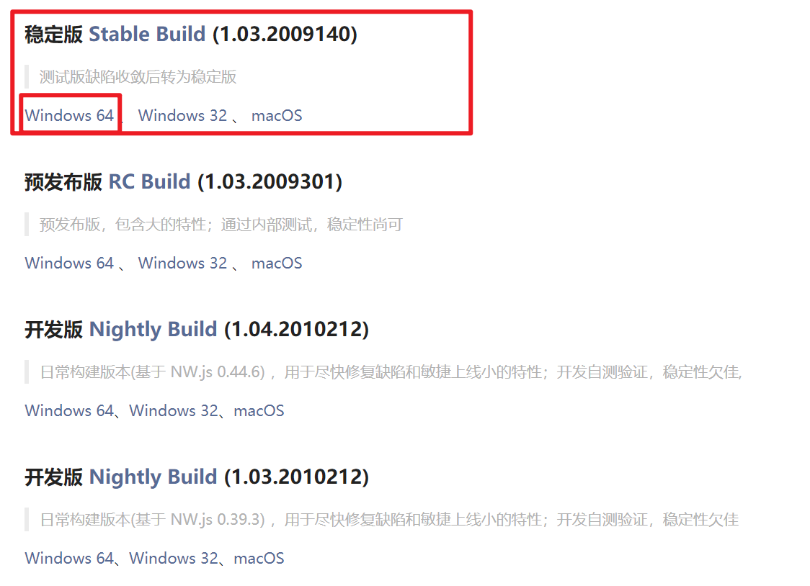
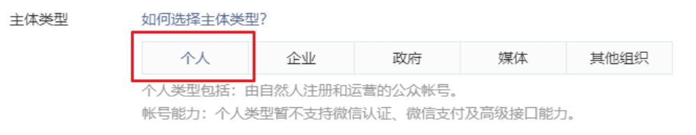
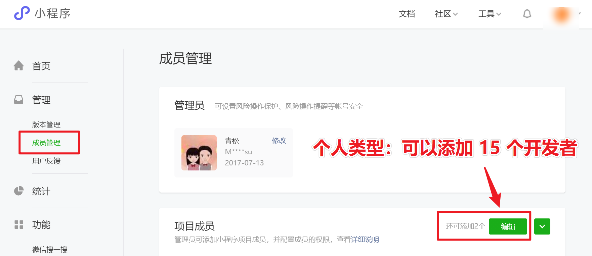

# 开发工具和注册账号
## 微信开发者工具下载
下载地址：

https://developers.weixin.qq.com/miniprogram/dev/devtools/download.html

建议下载稳定版，或者预发布版，如果安装不上继续换其他版本，所有版本都安装不了，只能重装系统。

## 微信开发者账号注册

### 微信公众平台注册地址

https://mp.weixin.qq.com/wxopen/waregister?action=step1&token=&lang=zh_CN

### 注意事项

1. 账号信息。

   - 学习阶段建议大家使用一个`全新`的邮箱 (小号)，注册开发者(因为久了没用账号会被微信冻结)。
   - 邮箱使用 163 邮箱，qq 邮箱 都可以，没有邮箱就注册个新的邮箱账号。

2. 邮箱激活。

   - 登录邮箱点击邮件激活即可。

3. 管理员信息登记 - 重要

   - 主体类型  -  选择 《个人》🚩
   - 真实身份证号码，真实手机号码登记。
   - 小程序管理员微信号要求：绑定过 **银行卡** 的微信扫码验证。

   

## 添加项目成员

## 项目成员权限

1. 可以共享当前小程序的 `appid`。
2. 可以 扫码 或 通过分享 `打开未上线的项目`。
3. 如果有账号密码，可以登录小程序后台管理系统。
4. 可以上传小程序开发代码。
5. ...