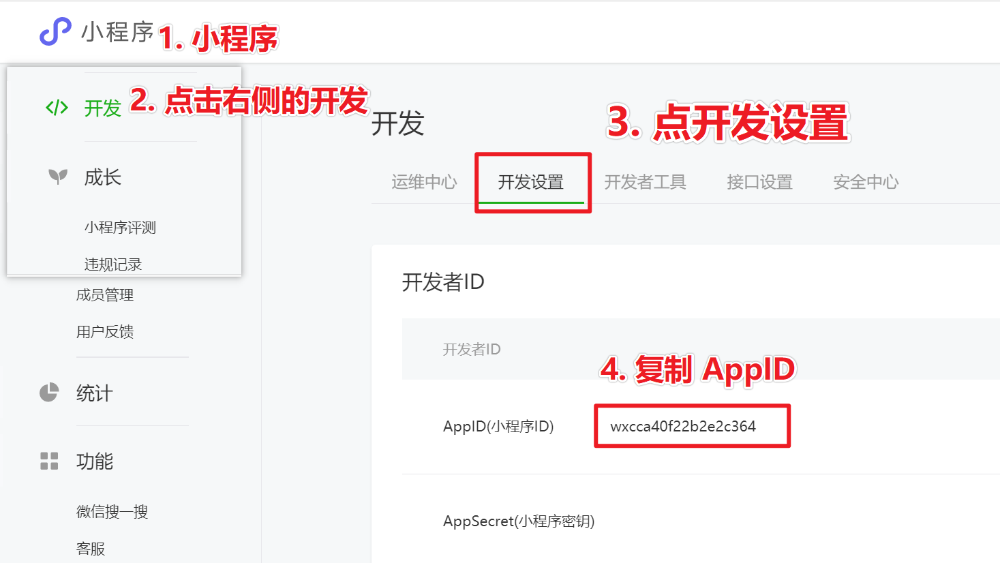
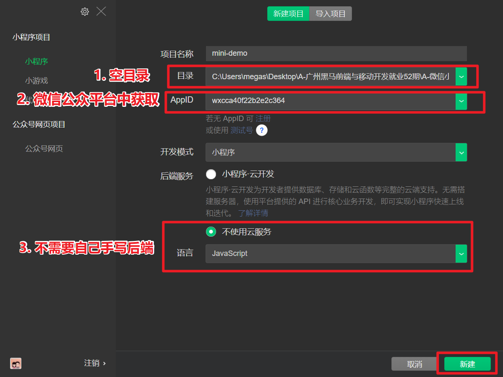
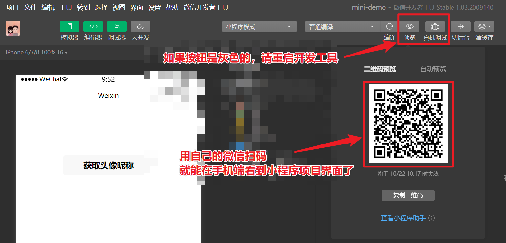
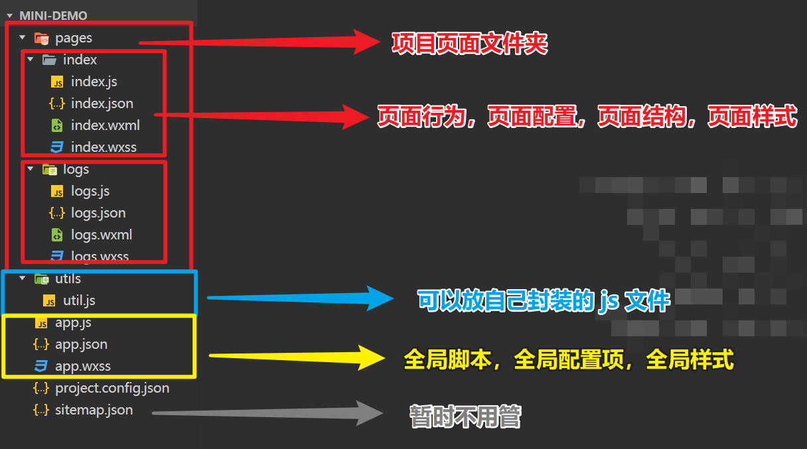
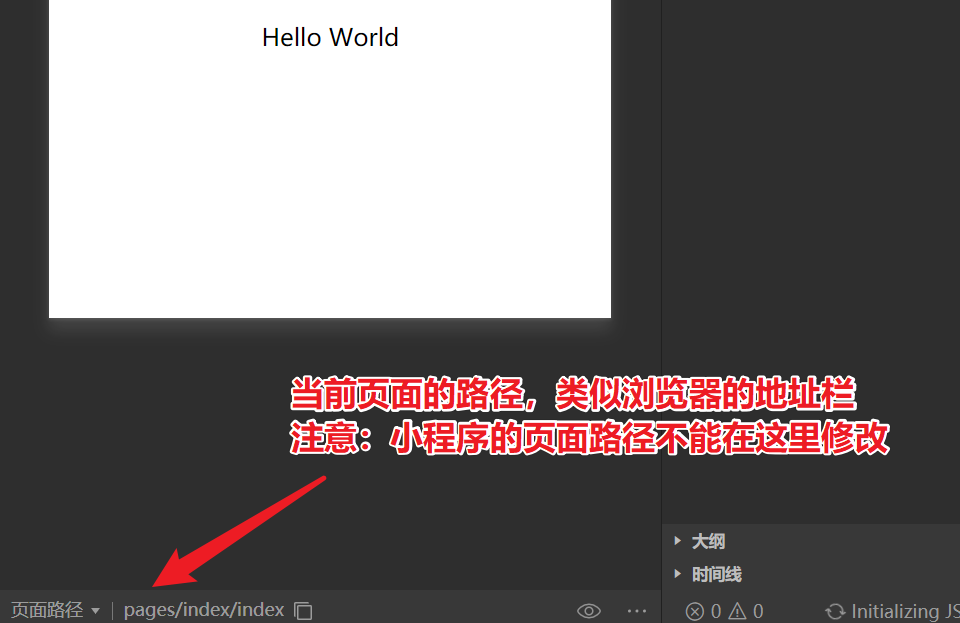
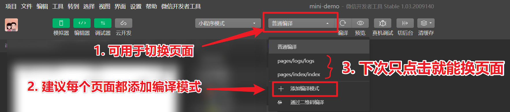
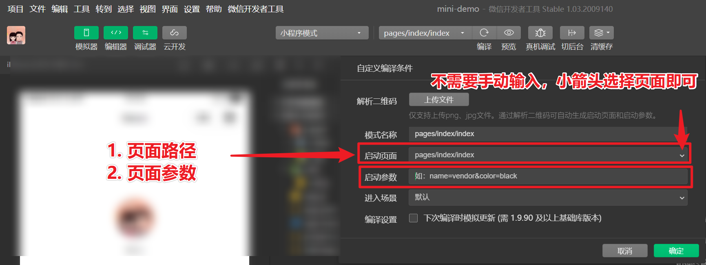
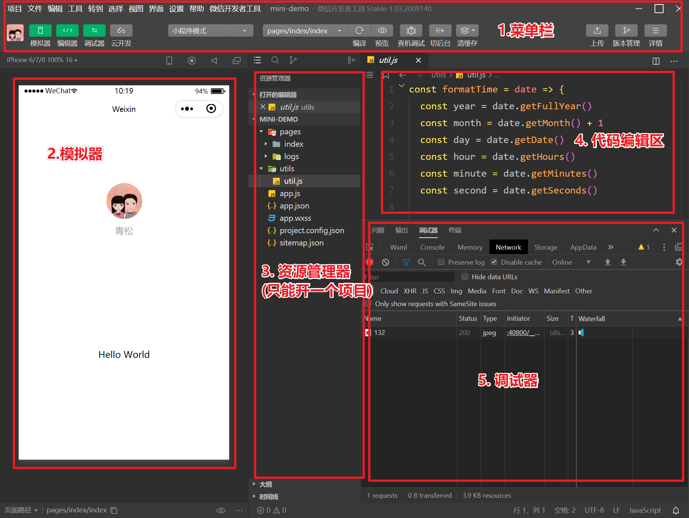

# 新建微信小程序项目

> 注意：新建项目的时候需要填写小程序 `appid`。

## 获取 `APPID`

## 新建项目

## 手机端预览

## 项目目录结构

## 查看当前页面路径

## 切换项目页面

## 页面路径和页面参数

## 微信开发工具小结

微信开发工具：可以理解为   Chrome (浏览器) +   VS Code (编辑器)  +  WebPack (打包构建工具)

