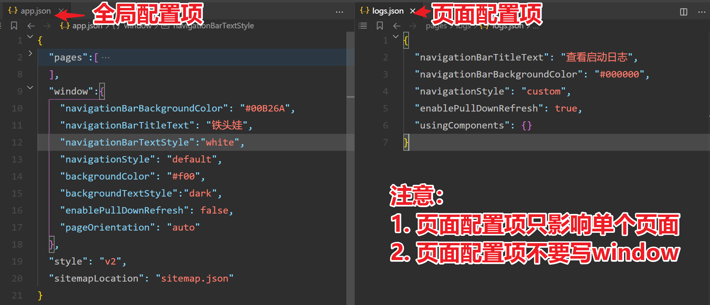

## xxx.json 局部配置项

## 概述

每一个小程序页面也可以使用 `.json` 文件来对本页面的窗口表现进行配置。

页面中配置项在当前页面会覆盖 `app.json` 的 `window` 中相同的配置项。

注意事项：

1. 页面的 `json` 配置项属于局部配置，只对单个页面生效。
2. 页面配置项结构和全局配置项不一样，页面配置项，不要写  `window`，写了反而是错的。

## 全局配置项和页面配置项 对比

