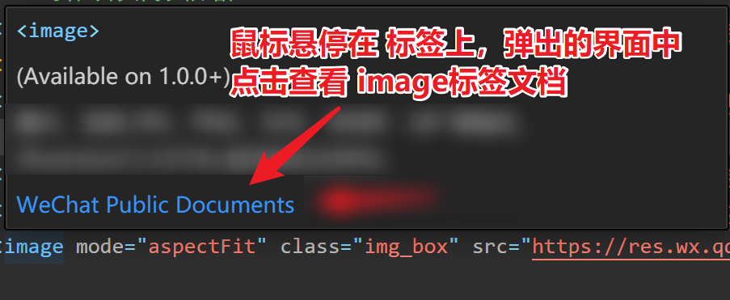
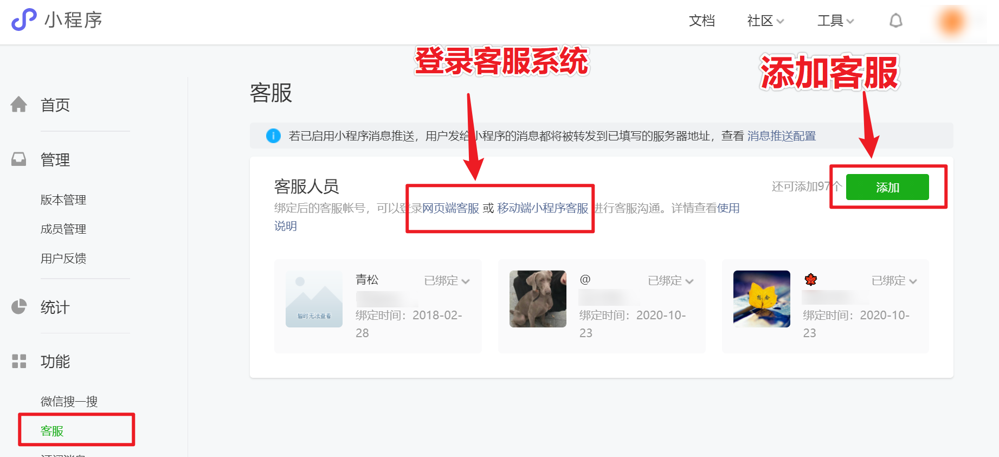

# 常用组件 - 标签

## `page` 页面根组件

小程序的页面根标签为 `<page>`，相当于 `html` 的 `body` 标签。

## `view` 容器组件

代替之前 `html`  的 `<div>` 

`h1 ~ h6，p，ul ，ol， li, dl， dt， dd ，table ,  header,  nav,  section` 等都不支持。

所以在小程序开发的时候不需要注意标签语义化问题。布局的时候首选都是 view 标签。

`<view>` 标签可通过添加类名，配合 `wxss` 样式的方式实现不同的页面布局。

## `text` 文本组件

1. text 组件支持回车键换行，也可以通过 `\n` 换行。
2. 长按文字可以复制（只有 text 标签有这个功能，手机端和模拟器长按选择效果有差异）
3. 只能嵌套 text

| 属性        | 类型    | 默认值 | 说明                                                |
| :---------- | :------ | :----- | :-------------------------------------------------- |
| user-select | boolean | false  | 文本是否可选，该属性会使文本节点显示为 inline-block |
| decode      | boolean | false  | 是否解码，`&emsp;` 一个字符大小                     |
| space       | string  |        | 显示连续空格，`space="emsp"  `一个字符大小          |

## `image` 图片组件

1. 图片标签，image 组件默认宽高（🧨记得手动设置宽高）。
2. 支持懒加载。

```xml
<image src="../../../images/tabs/cart.png" />

<image src="/../images/tabs/cart_selected.png" />
```

| 属性名    | 类型    | 默认值        | 说明                                                       |
| --------- | ------- | ------------- | ---------------------------------------------------------- |
| src       | String  |               | 图片资源地址                                               |
| mode      | String  | `scaleToFill` | 图片裁剪、缩放的模式                                       |
| lazy-load | Boolean | false         | 图片`懒加载`                                               |
| webp      | Boolean | false         | `webp`图片格式比 `jpg` 和 `png` 更小，旧版手机和微信不支持 |

**mode 有效值：**

| 值           | 说明                                                 | 备注                       |
| ------------ | ---------------------------------------------------- | -------------------------- |
| `aspectFit`  | 保持纵横比缩放图片，使图片的长边能完全显示出来。     | 预览大图（图片能完整显示） |
| `aspectFill` | 保持纵横比缩放图片，只保证图片的短边能完全显示出来。 | 头像容器，朋友圈多图展示   |
| `widthFix`   | 宽度不变，高度自动变化，保持原图宽高比不变           | 高度自适应                 |
| `heightFix`  | 缩放模式，高度不变，宽度自动变化，保持原图宽高比不变 | 宽度自适应                 |

建议：模式使用的时候不要死记硬背属性的值，特容易混淆，建议查看文档，第一个不是想要的就换第二个...。



## `swiper` 滑动组件

1. `swiper` 容器组件默认样式有高度 `150px `(🧨开发的时候记得修改)
2. `<swiper-item>` 容器有 `width:100%; height:100%; postion:absolute;`

```xml
<swiper>
	<swiper-item>滑动项1</swiper-item>
	<swiper-item>滑动项2</swiper-item>
	<swiper-item>滑动项3</swiper-item>
</swiper>
```

`<swiper>` 组件属性：

| 属性名                 | 类型    | 默认值            | 说明                 |
| ---------------------- | ------- | ----------------- | -------------------- |
| indicator-dots         | Boolean | false             | 是否显示面板指示点   |
| indicator-color        | Color   | rgba(0, 0, 0, .3) | 指示点颜色           |
| indicator-active-color | Color   | #000000           | 当前选中的指示点颜色 |
| autoplay               | Boolean | false             | 是否自动切换         |
| interval               | Number  | 5000              | 自动切换时间间隔     |
| circular               | Boolean | false             | 是否循环轮播         |
## button 按钮

### 超级按钮 - 调用微信开放能力

微信开放能力是`原生微信 App` 里面的功能，模拟器无法模拟原生 `app`，以下功能都需要微信扫码体验真实效果。

| **open-type 的合法值** | 功能描述             | 备注                                                 |
| ---------------------- | -------------------- | ---------------------------------------------------- |
| `share`                | 调用分享功能         | 可以分享给个人，微信群，项目成员有权访问未上线的项目 |
| `contact`              | 调用客服功能         | 登录微信公众平台，配套客服管理系统                   |
| `getUserInfo`          | 调用获取用户信息功能 | 需要通过小程序的事件获取                             |
| `getPhoneNumber`       | 获取用户手机号功能   | 个人开发者没法调用，需要企业账号才能调用             |

### 微信开放能力 - 客服聊天


## navigator 导航组件

### 参考代码

```jsx
<text class="title">导航标签-基础</text>
<navigator url="../demo06/index">跳转到demo06</navigator>
<navigator url="/pages/demo06/index">跳转到demo06</navigator>
<navigator url="/pages/demo07/index">跳转到demo07自己</navigator>


<text class="title">导航标签-跳转tabBar页 🚩</text>
<navigator open-type="switchTab" url="/pages/demo01/index">tabBar页demo01</navigator>
<navigator open-type="switchTab" url="/pages/demo02/index">tabBar页demo02</navigator>
<navigator open-type="switchTab" url="/pages/demo03/index">tabBar页demo03</navigator>
<navigator open-type="switchTab" url="/pages/demo04/index">tabBar页demo04</navigator>


<text class="title">导航标签-替换页面</text>
<navigator open-type="navigate" url="/pages/demo06/index">跳转到demo06</navigator>
<navigator open-type="redirect" url="/pages/demo06/index">替换到demo06</navigator>


<text class="title">导航标签-返回上一页</text>
<navigator url="/pages/demo07/index">跳转到新的demo07</navigator>
<navigator open-type="navigateBack" delta="1">返回上一页</navigator>
<navigator open-type="navigateBack" delta="2">回退两级</navigator>
```

### 小程序页面分类

- `tabBar` 页，在 `app.json` 的 `tabBar` 中配置过的页面，最多 5 个，`tabBar` 页打开后就一直在内存中。
- 普通页，底部没有 tab 栏的，普通页没法展示 `tabBar`，普通页点击了返回后会被销毁。

### 打开方式

| **open-type 的合法值**     | 功能说明         | 备注                                       |
| -------------------------- | ---------------- | ------------------------------------------ |
| `open-type="navigate"`     | 打开新的普通页   | 默认值，可以省略不写                       |
| `open-type="switchTab"`    | 切换 `tabBar` 页 | 打开 `tabBar` 页的时候会`销毁`所有`普通页` |
| `open-type="redirect"`     | 替换普通页面     | 支付成功后，登录成功后                     |
| `open-type="navigateBack"` | 返回上一页       | 自定义返回按钮                             |

### 小结

1. 小程序是多页面应用，`Vue` 是单页面应用。
2. 小程序页面分两类，`普通页` 和 `tabBar` 页。
3. 最多同时保留`10`个普通页面，到达10页后无法再打开新的普通页。
4. 跳转 `tabBar` 页需要指定 `open-type="switchTab"`，否则无法跳转。
5. `tabBar` 左上角没有返回箭头，跳转 `tabBar` 的时候，所有`普通页`都会被`销毁`。

## rich-text 富文本(渲染)组件

功能相当于 `Vue` 中的 `v-html`。

可以在小程序中渲染静态的 `html` 内容。

```jsx
<rich-text nodes="{{ 富文本内容 }}"></rich-text>
```

## 其他组件

### `icon` 组件

```xml
<icon type="success"></icon>
<icon type="success_no_circle"></icon>
<icon type="info"></icon>
<icon type="warn"></icon>
<icon type="waiting"></icon>
<icon type="cancel"></icon>
<icon type="download"></icon>
<icon type="search"></icon>
<icon type="clear"></icon>
```

### `checkbox `组件

```jsx
<checkbox-group bind:change="getCheckboxValue">
  <label>吃饭：<checkbox value="chifan" color="#FA5151"></checkbox></label>
  <label>睡觉：<checkbox value="shuijiao"  color="#FA5151"></checkbox></label>
  <label>打豆豆：<checkbox  value="dadoudou"  color="#FA5151"></checkbox></label>
</checkbox-group>

// pages/demo09/index.js
Page({
  // 获取 checkbox 复选按钮编组的值，获取的数据格式是数组
  getCheckboxValue(e){
    console.log(e.detail.value);    // ["dadoudou", "chifan", "shuijiao"]
  },
})
```

### `radio` 组件

```jsx
<radio-group bind:change="getRadioValue">
  <label>吃饭：<radio checked value="chifan" color="#FA5151"></radio></label>
  <label>睡觉：<radio disabled value="shuijiao"  color="#FA5151"></radio></label>
  <label>打豆豆：<radio  value="dadoudou"  color="#FA5151"></radio></label>
</radio-group>

// pages/demo09/index.js
Page({
  // 获取单选框的值，获取的数据格式是字符串
  getRadioValue(e){
    console.log(e.detail.value);    // "chifan"
  }
})
```

### 注意事项

1.  `icon` 组件可以改大小和颜色。
2.  `checkbox`  `radio` 微信只提供颜色的修改属性，不能修改大小。
