# 微信小程序云开发

## 介绍

开发者可以使用云开发开发微信小程序、小游戏，`无需搭建服务器`，即可使用云端能力。

相当于全栈方向。

## 新建云开发项目

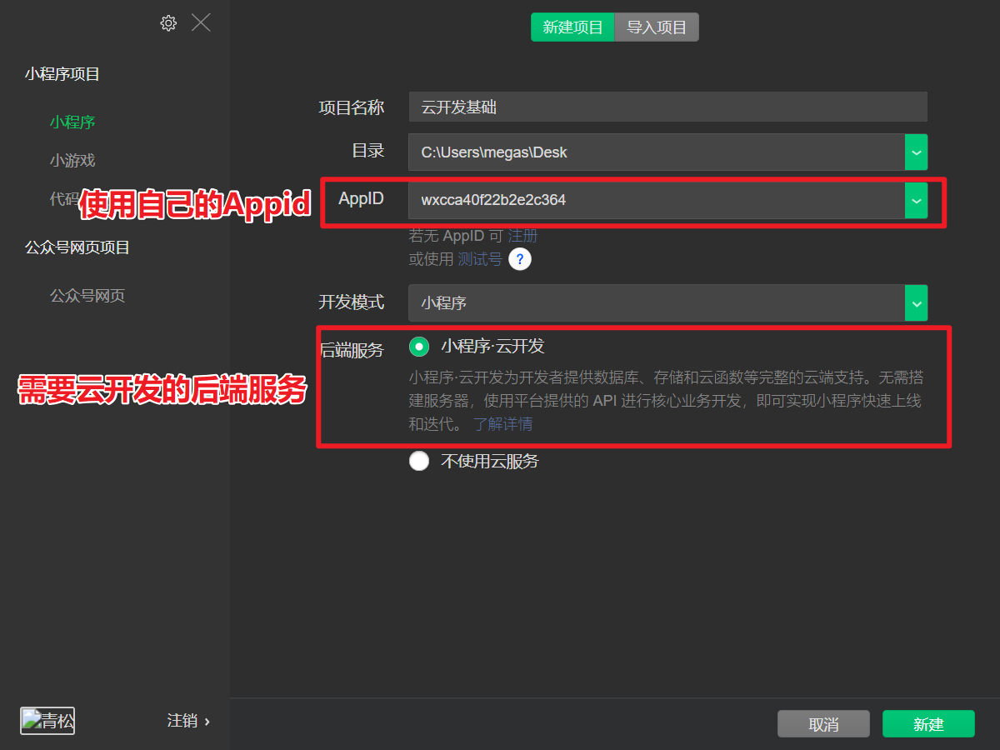

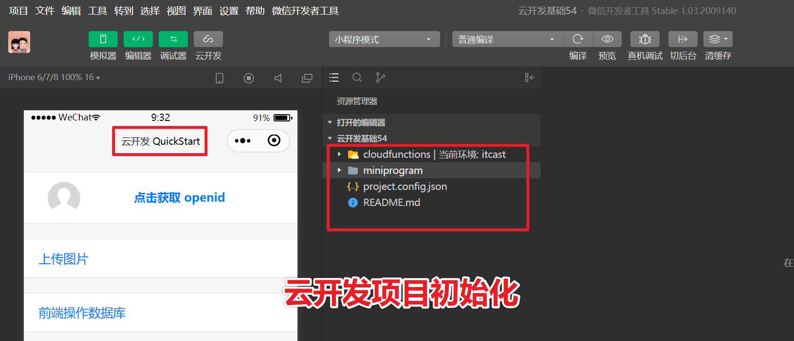

## 开通小程序·云开发

1. 云开发提供了免费的接口服务器，免费的存储空间，免费的数据库。
2. 第一次使用需要开通服务，同时创建云开发环境。

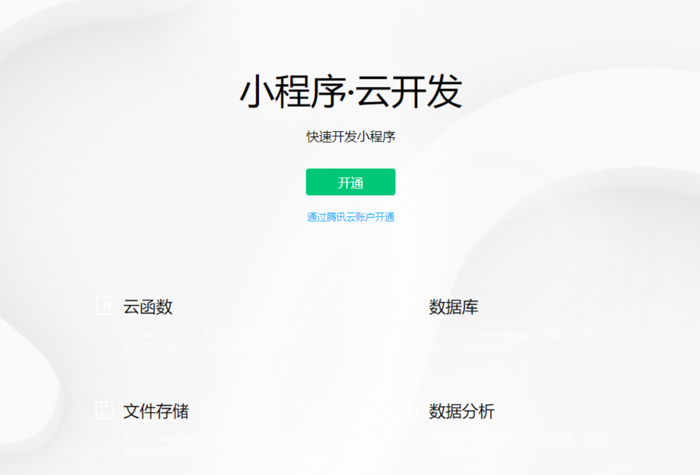


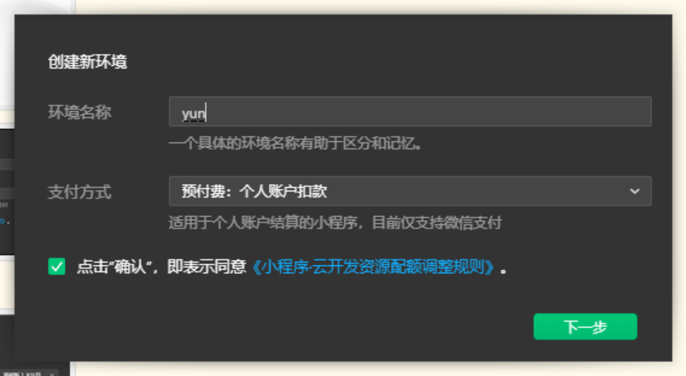

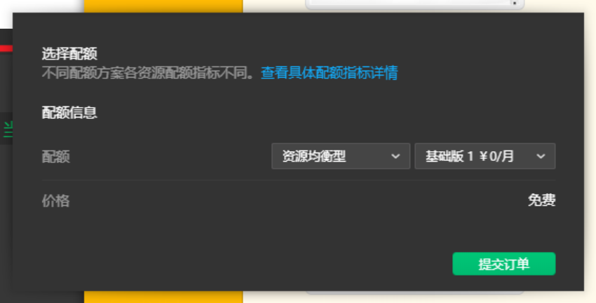

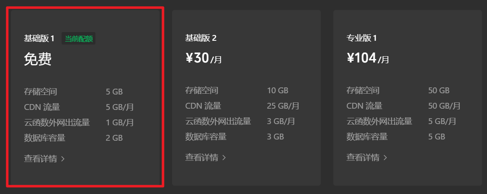

## 新建环境

记得复制环境名字，开发的时候需要用到。 `hm54-9ggy9ynhd3c080fb`

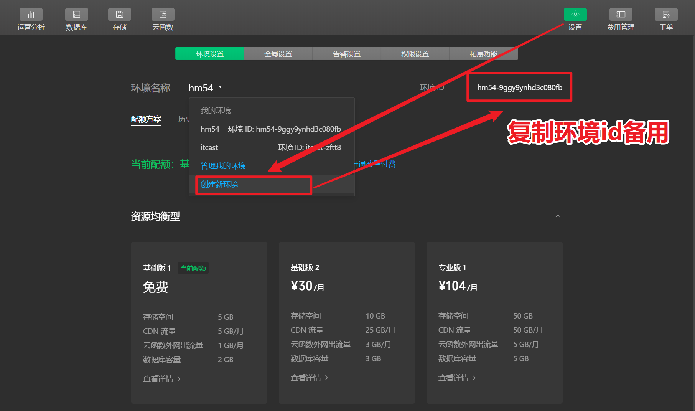

## 云开发后端和传统服务器后端差别

### 传统服务器后端

1. 前端开发者无法直接读取和写入文件，无法直接操作数据库。
2. 前端要读写文件，操作数据，需要依赖服务端环境，通过发送请求和接收响应实现业务。

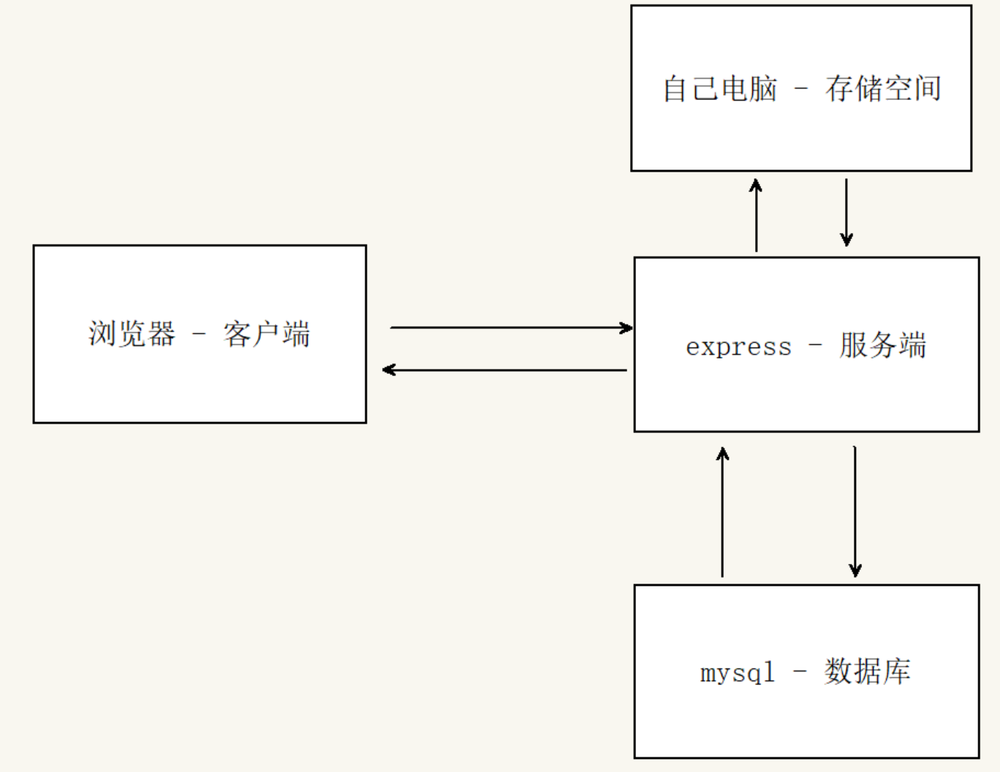

### 小程序云开发

小程序云开发，主要多了两大功能：

1. 小程序可以直接上传资源到云存储空间。
2. 小程序可以直接对数据库进行增删改查操作。

有点：这个转变可以让小程序前端拥有更强的能力，后端变得没有那么重要了。

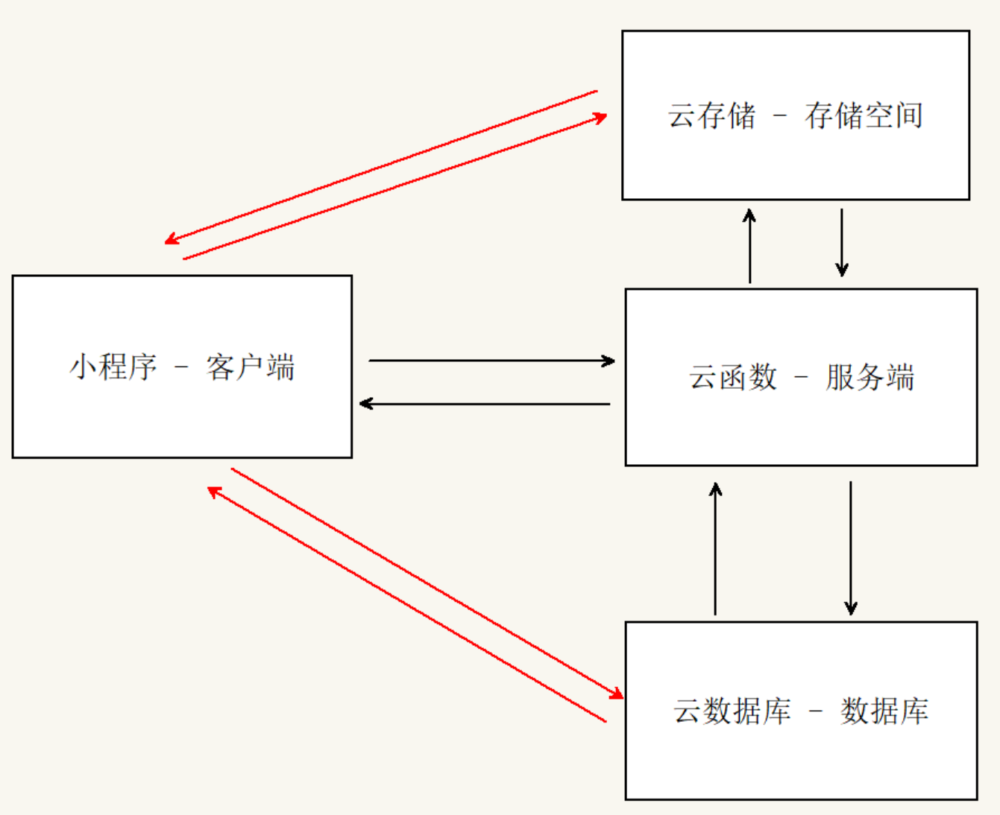

### 云开发核心3大概念

1. 云数据库
2. 云存储
3. 云函数

## 云存储

1. 免费环境提供 `5G` 存储空间，可以上传 `html` 页面，图片，视频等资源。
2.  `cloud://` 这种协议只能在小程序内部使用。
3.  浏览器能识别的 `https://` 这种协议的地址。
4. 如果要在其他项目中引入云存储的资源，请使用 `https://` 这种地址。
5. 云储存还提供了对应的 `API`，可以直接通过小程序端`代码实现上传`。

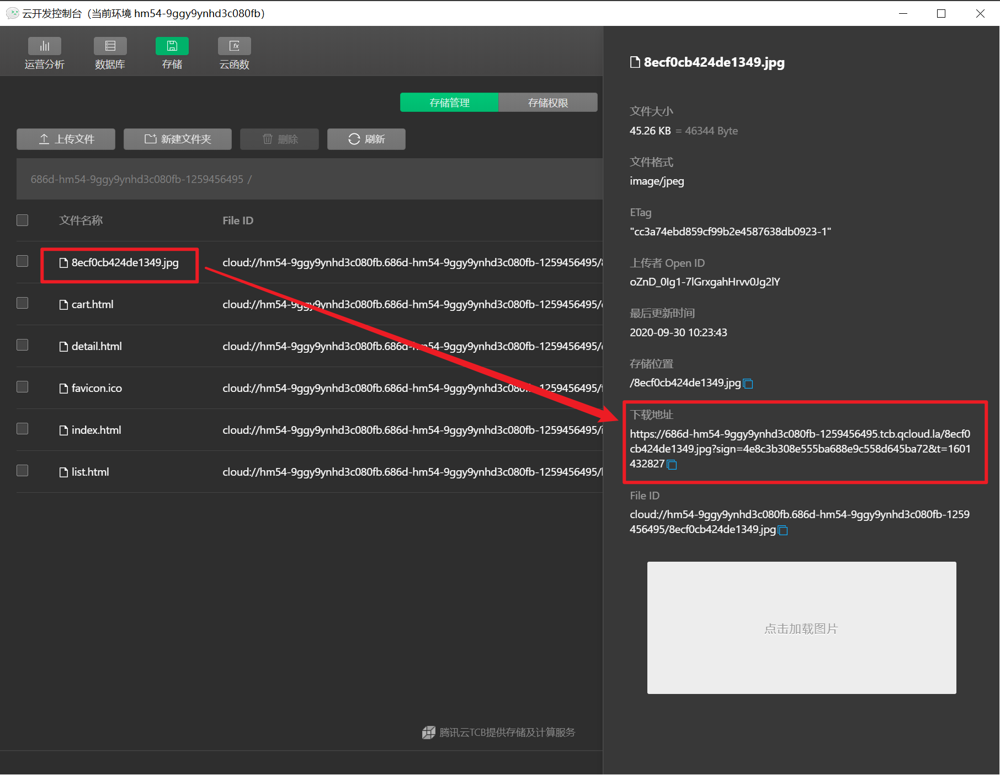

## 小程序端 - 文件上传

### 文件上传主要分两步

1. 选择文件。
2. 上传文件。

### 选择文件

`wx.chooseImage()`

`wx.chooseVideo()`

`wx.chooseMedia()`

### 上传文件 API

```jsx
wx.cloud.uploadFile({
  cloudPath: 'example.png',  // 存储时的文件名
  filePath: '', 			// 要上传文件资源的路径
})
.then(res => {
  console.log(res.fileID)
})
.catch(error => {
  // handle error
})
```

### 注意事项

1. 将本地资源上传至云存储空间
2. 如果上传至同一路径则是覆盖写入，所以上传的时候注意改名。

## 新建云开发环境 - 注意

1. 设置  -  新建环境，并复制名称 ，注意每个同学的环境变量都不一样。`gfg-5bd181(仅供参考)`

## 云数据库

### 新建数据库集合

1. 新建的集合可以理解为就是一个 `json` 文件。

2. 可以通过点击记录手动添加数据。

3. 可以导入 `json` 文件 和 导出 `json` 文件。

### 注意事项 - 踩坑

- 导出和导入的 `json` 文件和我们之前学习的不一样。
- 云开发导入和导出的 `json` 文件，`一条数据占一行`，而且每条数据之间`不需要用逗号结束`。
- 所以通过按钮点击导入导出平常比较少用，更多的是通过代码的方式导入数据。

### 新建集合步骤

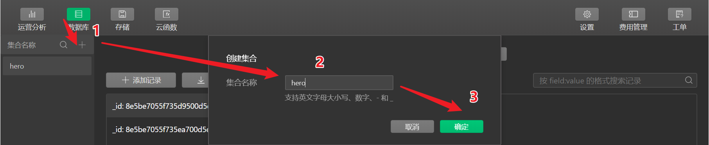

## 小程序端项目精简

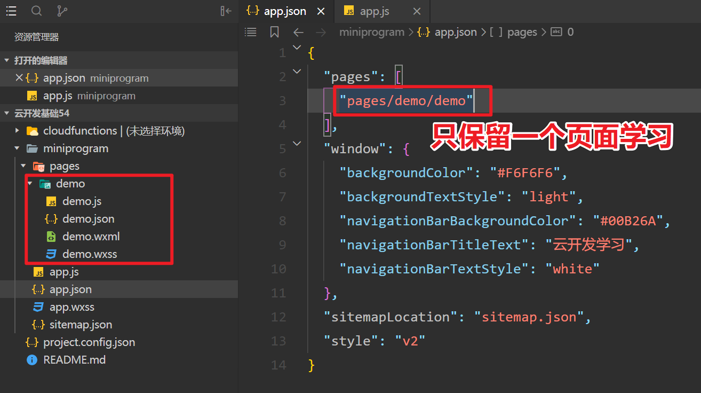

## 数据库操作- 🚩

### 云环境初始化

> 在调用云开发各 `API` 前，需先调用初始化方法 `init` 一次（全局只需一次，多次调用时只有第一次生效）

```js
// 1. 初始化云环境
//app.js
App({
  // 小程序启动时触发的生命周期函数
  onLaunch: function () {
      // 全局只需一次，多次调用时只有第一次生效
      wx.cloud.init({
        env: "itcast-zftt8"
      })
  }
})

```

### 连接数据库并打开某个集合

```js
// 2. 连接云数据库
const db = wx.clound.database();
// 3. 打开 hero 集合(文件)
const heroCollection = db.collection('hero');
```

### 增加

```js
.add({
	data:{
		name:'小明'
	}
})
```

### 查询全部

```js
.get()
```

### 修改集合数据权限

1. 云数据库有权限的概念：默认情况下，哪个用户新增的数据，哪个用户可以查看和修改，其他用户看不到。
2. 如果想要让新增的数据给所有小程序用户都能查询到，可以修改数据库集合的权限。

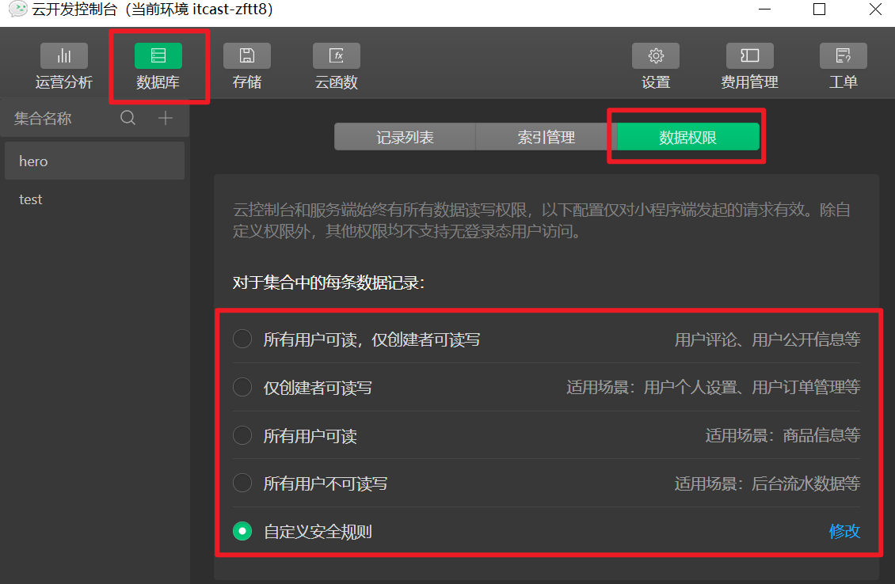

PS：为了开发更加方便操作`数据库`，数据权限建议选择`自定义安全规则`。

测试阶段把规则设置为 `允许所有用户可读，允许所有用户可写`，配置参考如下：

```json
{
  "read": true,
  "write": true
}
```

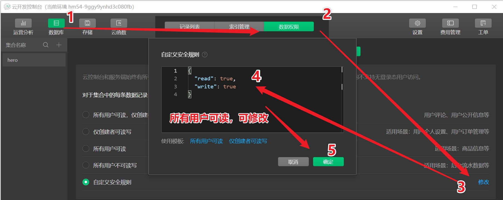

### 根据id查询

```js
.doc(_id)
.get()
```

### 模糊条件查询

可通过 `正则表达式` 配合 `where` 条件进行模糊匹配。


```js
// 原生 JavaScript 对象
.where({
  name: /李白/i
})
.get()

// 把字符串转成正则对象
.where({
  name: db.RegExp({
    regexp: '李白',
    options: 'i',
  })
})
.get()
```

| flag | 说明                                                         |
| :--- | :----------------------------------------------------------- |
| i    | 大小写不敏感                                                 |
| m    | 跨行匹配；让开始匹配符 `^` 或结束匹配符 `$` 时除了匹配字符串的开头和结尾外，还匹配行的开头和结尾 |

### 删除

```js
.doc(_id)
.remove()
```

### 修改

```js
.doc(_id)
.update({
    data: {
    	键名称: 值
    }
});
```


### 数据搜索

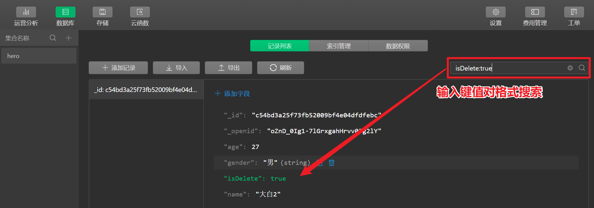


## 项目初始化

注意事项：进入 `miniprogram` 文件夹，再执行初始化 npm 项目和 安装 npm 包的命令。

常见错误：直接在根云开发项目的目录初始化。

### 安装 Vant UI 小程序版

```shell
# 进入 小程序项目目录
cd miniprogram

# 初始化项目
npm init

# 安装 vant UI 组件库
npm i @vant/weapp -S --production
```

### 构建 `npm` 包 🚩


```json
// app.json
"usingComponents": {
    "van-search": "@vant/weapp/search/index"
}
```

```xml
<van-search
  value="{{ value }}"
  shape="round"
  background="#00B26A"
  placeholder="请输入英雄名称"
/>
```

## App实例

`App` 实例其实类似 `Vue` 实例，都是全局的实例。

只不过小程序的全局 `App` 实例在页面中使用的时候，需要先通过 `getApp()`

```js
//app.js
App({
  onLaunch(){
    // 1. 初始化云环境
    wx.cloud.init({env: "hm54-9ggy9ynhd3c080fb" }); // 自己的环境名称 
    // 2. 连接云数据库
    const db = wx.cloud.database();
    // 3. 打开 hero 集合(文件) - 并把集合对象添加到全局 app 对象上
    this.hero = db.collection('hero'); // 自己新建的集合名称
  },
})
```

页面中获取全局`App`实例

```js
// 获取 App 全局实例
const app = getApp();
console.log(app);

// 直接调用
getApp().hero.get();
```


