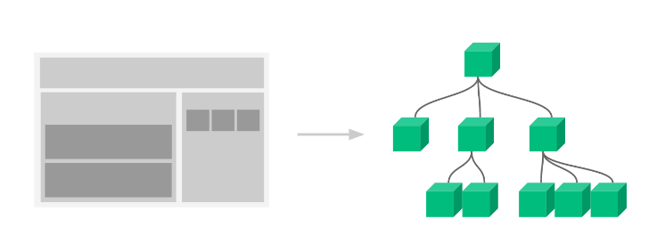

# React是什么
一个专注于构建用户界面的 JavaScript 库，和vue和angular并称前端三大框架，不夸张的说，react引领了很多新思想，世界范围内是最流行的js前端框架，最新版本已经到了18，加入了许多很棒的新特性。

React英文文档（https://reactjs.org/）

React中文文档 （https://zh-hans.reactjs.org/）

React新文档（https://beta.reactjs.org/）（开发中....）

## React的特点
1. 声明式UI（JSX）
写UI就和写普通的HTML一样，抛弃命令式的繁琐实现

2. 组件化
组件是react中最重要的内容，组件可以通过搭积木的方式拼成一个完整的页面，通过组件的抽象可以增加复用能力和提高可维护性 


3. 跨平台
react既可以开发web应用也可以使用同样的语法开发原生应用（react-native），比如安卓和ios应用，甚至可以使用react开发VR应用，想象力空间十足，react更像是一个 元框架  为各种领域赋能 
## 使用脚手架创建项目
```js
npx create-react-app 项目名称
// or
npm init vite
```
## 入口文件说明
```jsx
import React from 'react'
import ReactDOM from 'react-dom'
import './index.css'
// 引入根组件App
import App from './App'
// 通过调用ReactDOM的render方法渲染App根组件到id为root的dom节点上
ReactDOM.render(
  <React.StrictMode>
    <App />
  </React.StrictMode>,
  document.getElementById('root')
)
```