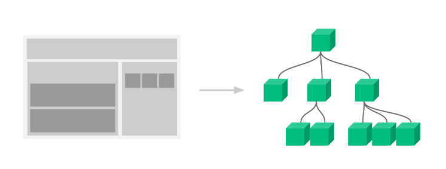

# 组件概念

## 函数式组件
使用 JS 的函数（或箭头函数）创建的组件，就叫做函数组件
```jsx
// 定义函数组件
function HelloFn () {
  return <div>这是我的第一个函数组件!</div>
}

// 定义类组件
function App () {
  return (
    <div className="App">
      {/* 渲染函数组件 */}
      <HelloFn />
      <HelloFn></HelloFn>
    </div>
  )
}
export default App
```
约定说明
1. 组件的名称必须首字母大写，react内部会根据这个来判断是组件还是普通的HTML标签
2. 函数组件必须有返回值，表示该组件的 UI 结构；如果不需要渲染任何内容，则返回 null
3. 组件就像 HTML 标签一样可以被渲染到页面中。组件表示的是一段结构内容，对于函数组件来说，渲染的内容是函数的返回值就是对应的内容
4. 使用函数名称作为组件标签名称，可以成对出现也可以自闭合
## 类组件
使用 ES6 的 class 创建的组件，叫做类（class）组件
```jsx
// 引入React
import React from 'react'

// 定义类组件
class HelloC extends React.Component {
  render () {
    return <div>这是我的第一个类组件!</div>
  }
}

function App () {
  return (
    <div className="App">
      {/* 渲染类组件 */}
      <HelloC />
      <HelloC></HelloC>
    </div>
  )
}
export default App
```
约定说明
1. 类名称也必须以大写字母开头
2. 类组件应该继承 React.Component 父类，从而使用父类中提供的方法或属性
3. 类组件必须提供 render 方法render 方法必须有返回值，表示该组件的 UI 结构
## 函数组件的事件绑定
### 1. 如何绑定事件
- 语法
on + 事件名称 = { 事件处理程序 } ，比如：`<div onClick={ onClick }></div> `
- 注意点
react事件采用驼峰命名法，比如：onMouseEnter、onFocus 
```jsx
// 函数组件
function HelloFn () {
  // 定义事件回调函数
  const clickHandler = () => {
    console.log('事件被触发了')
  }
  return (
    // 绑定事件
    <button onClick={clickHandler}>click me!</button>
  )
}
```
### 2. 获取事件对象
获取事件对象e只需要在 事件的回调函数中 补充一个形参e即可拿到
```jsx
// 函数组件
function HelloFn () {
  // 定义事件回调函数
  const clickHandler = (e) => {
    console.log('事件被触发了', e)
  }
  return (
    // 绑定事件
    <button onClick={clickHandler}>click me!</button>
  )
}
```
### 3. 传递额外参数
解决思路: 改造事件绑定为箭头函数 在箭头函数中完成参数的传递
```jsx

import React from "react"

// 如何获取额外的参数？
// onClick={ onDel } -> onClick={ () => onDel(id) }
// 注意: 一定不要在模板中写出函数调用的代码 onClick = { onDel(id) }  bad!!!!!!

const TestComponent = () => {
  const list = [
    {
      id: 1001,
      name: 'react'
    },
    {
      id: 1002,
      name: 'vue'
    }
  ]
  const onDel = (e, id) => {
    console.log(e, id)
  }
  return (
      <ul>
        {list.map(item =>（
           <li key={item.id}>
                {item.name}
                <button onClick={(e) => onDel(e, item.id)}>x</button>
           </li>
        ))}
      </ul>
  )
}

function App () {
  return (
    <div>
      <TestComponent />
    </div>
  )
}


export default App
```
## 类组件的事件绑定
类组件中的事件绑定，整体的方式和函数组件差别不大
唯一需要注意的 因为处于class类语境下 所以定义事件回调函数以及定它写法上有不同
1. 定义的时候: class Fields语法  
2. 使用的时候: 需要借助this关键词获取
```jsx

import React from "react"
class CComponent extends React.Component {
  // class Fields
  clickHandler = (e, num) => {
    // 这里的this指向的是正确的当前的组件实例对象 
    // 可以非常方便的通过this关键词拿到组件实例身上的其他属性或者方法
    console.log(this)
  }

  clickHandler1 () {
    // 这里的this 不指向当前的组件实例对象而指向undefined 存在this丢失问题
    console.log(this)
  }

  render () {
    return (
      <div>
        <button onClick={(e) => this.clickHandler(e, '123')}>click me</button>
        <button onClick={this.clickHandler1}>click me</button>
      </div>
    )
  }
}

function App () {
  return (
    <div>
      <CComponent />
    </div>
  )
}

export default App
```
## 组件状态
一个前提：在React hook出来之前，函数式组件是没有自己的状态的，所以我们统一通过类组件来讲解
### 1. 初始化状态
- 通过class的实例属性state来初始化 
- state的值是一个对象结构，表示一个组件可以有多个数据状态 
```jsx
class Counter extends React.Component {
  // 初始化状态
  state = {
    count: 0
  }
  render() {
    return <button>计数器</button>
  }
}
```
### 2. 读取状态
```jsx
class Counter extends React.Component {
  // 初始化状态
  state = {
    count: 0
  }
  render() {
    // 读取状态
    return <button>计数器{this.state.count}</button>
  }
}
```
### 3. 修改状态
- 语法
this.setState({ 要修改的部分数据 }) 
- setState方法作用 
  1. 修改state中的数据状态
  2. 更新UI
- 思想
     数据驱动视图，也就是只要修改数据状态，那么页面就会自动刷新，无需手动操作dom 
- 注意事项
	 不要直接修改state中的值，必须通过setState方法进行修改 
```jsx
class Counter extends React.Component {
  // 定义数据
  state = {
    count: 0
  }
  // 定义修改数据的方法
  setCount = () => {
    this.setState({
      count: this.state.count + 1
    })
  }
  // 使用数据 并绑定事件
  render () {
    return <button onClick={this.setCount}>{this.state.count}</button>
  }
}
```