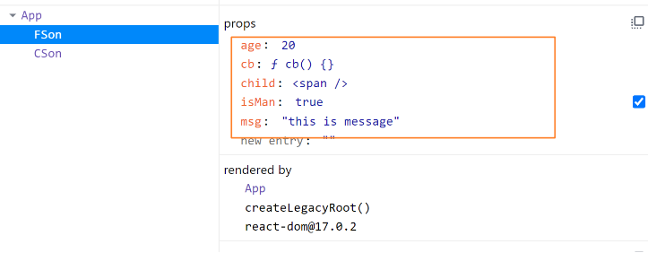
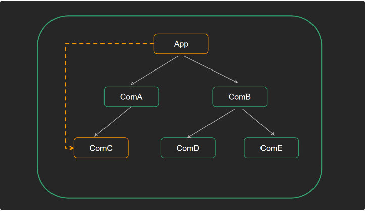

# React组件通信
## 组件通信的意义
组件是独立且封闭的单元，默认情况下组件只能使用自己的数据（state）

组件化开发的过程中，完整的功能会拆分多个组件，在这个过程中不可避免的需要互相传递一些数据

为了能让各组件之间可以进行互相沟通，数据传递，这个过程就是组件通信

1. 父子关系 -  最重要的
2. 兄弟关系 -  自定义事件模式产生技术方法 eventBus  /  通过共同的父组件通信
3. 其它关系 -  mobx / redux / zustand
## 父传子实现
1. 父组件提供要传递的数据  -  state 
2. 给子组件标签添加属性值为 state中的数据 
3. 子组件中通过 props 接收父组件中传过来的数据 
   - 类组件使用this.props获取props对象
   - 函数式组件直接通过参数获取props对象
```jsx
import React from 'react'

// 函数式子组件
function FSon(props) {
  console.log(props)
  return (
    <div>
      子组件1
      {props.msg}
    </div>
  )
}

// 类子组件
class CSon extends React.Component {
  render() {
    return (
      <div>
        子组件2
        {this.props.msg}
      </div>
    )
  }
}
// 父组件
class App extends React.Component {
  state = {
    message: 'this is message'
  }
  render() {
    return (
      <div>
        <div>父组件</div>
        <FSon msg={this.state.message} />
        <CSon msg={this.state.message} />
      </div>
    )
  }
}

export default App
```
## props说明
1.  props是只读对象（readonly）
根据单项数据流的要求，子组件只能读取props中的数据，不能进行修改

2. props可以传递任意数据
数字、字符串、布尔值、数组、对象、函数、JSX
```jsx
class App extends React.Component {
  state = {
    message: 'this is message'
  }
  render() {
    return (
      <div>
        <div>父组件</div>
        <FSon 
          msg={this.state.message} 
          age={20} 
          isMan={true} 
          cb={() => { console.log(1) }} 
          child={<span>this is child</span>}
        />
        <CSon msg={this.state.message} />
      </div>
    )
  }
}
```


## 子传父实现
口诀： 父组件给子组件传递回调函数，子组件调用

实现步骤
1. 父组件提供一个回调函数 - 用于接收数据
2. 将函数作为属性的值，传给子组件
3. 子组件通过props调用 回调函数
4. 将子组件中的数据作为参数传递给回调函数
```jsx
import React from 'react'

// 子组件
function Son(props) {
  function handleClick() {
    // 调用父组件传递过来的回调函数 并注入参数
    props.changeMsg('this is newMessage')
  }
  return (
    <div>
      {props.msg}
      <button onClick={handleClick}>change</button>
    </div>
  )
}


class App extends React.Component {
  state = {
    message: 'this is message'
  }
  // 提供回调函数
  changeMessage = (newMsg) => {
    console.log('子组件传过来的数据:',newMsg)
    this.setState({
      message: newMsg
    })
  }
  render() {
    return (
      <div>
        <div>父组件</div>
        <Son
          msg={this.state.message}
          // 传递给子组件
          changeMsg={this.changeMessage}
        />
      </div>
    )
  }
}

export default App
```
## 兄弟组件通信
核心思路： 通过状态提升机制，利用共同的父组件实现兄弟通信

实现步骤
1. 将共享状态提升到最近的公共父组件中，由公共父组件管理这个状态 
   - 提供共享状态
   - 提供操作共享状态的方法
2. 要接收数据状态的子组件通过 props 接收数据
3. 要传递数据状态的子组件通过props接收方法，调用方法传递数据
```jsx
import React from 'react'

// 子组件A
function SonA(props) {
  return (
    <div>
      SonA
      {props.msg}
    </div>
  )
}
// 子组件B
function SonB(props) {
  return (
    <div>
      SonB
      <button onClick={() => props.changeMsg('new message')}>changeMsg</button>
    </div>
  )
}

// 父组件
class App extends React.Component {
  // 父组件提供状态数据
  state = {
    message: 'this is message'
  }
  // 父组件提供修改数据的方法
  changeMsg = (newMsg) => {
    this.setState({
      message: newMsg
    })
  }

  render() {
    return (
      <>
        {/* 接收数据的组件 */}
        <SonA msg={this.state.message} />
        {/* 修改数据的组件 */}
        <SonB changeMsg={this.changeMsg} />
      </>
    )
  }
}

export default App
```
## 跨组件通信Context

> 上图是一个react形成的嵌套组件树，如果我们想从App组件向任意一个下层组件传递数据，该怎么办呢？目前我们能采取的方式就是一层一层的props往下传，显然很繁琐
那么，Context 提供了一个无需为每层组件手动添加 props，就能在组件树间进行数据传递的方法

```jsx
import React, { createContext }  from 'react'

// 1. 创建Context对象 
const { Provider, Consumer } = createContext()


// 3. 消费数据
function ComC() {
  return (
    <Consumer >
      {value => <div>{value}</div>}
    </Consumer>
  )
}

function ComA() {
  return (
    <ComC/>
  )
}

// 2. 提供数据
class App extends React.Component {
  state = {
    message: 'this is message'
  }
  render() {
    return (
      <Provider value={this.state.message}>
        <div className="app">
          <ComA />
        </div>
      </Provider>
    )
  }
}

export default App
```