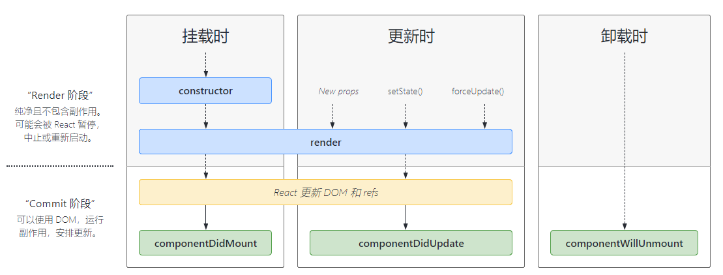
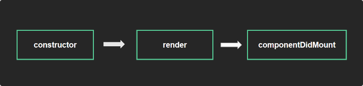

# 生命周期
## 生命周期 - 概述
组件的生命周期是指组件从被创建到挂载到页面中运行起来，再到组件不用时卸载的过程，注意，只有类组件才有生命周期（类组件 实例化  函数组件 不需要实例化）

[详细生命周期](http://projects.wojtekmaj.pl/react-lifecycle-methods-diagram/)
## 生命周期 - 挂载阶段

| 钩子函数 | 触发时机 | 作用 |
| ------- | --------- |----- |
| constructor | 创建组件时，最先执行，初始化的时候只执行一次 | 1. 初始化state  2. 创建 Ref 3. 使用 bind 解决 this 指向问题等 |
| render  | 每次组件渲染都会触发 | 渲染UI（注意： 不能在里面调用setState() ） |
| componentDidMount  | 组件挂载（完成DOM渲染）后执行，初始化的时候执行一次 | 1. 发送网络请求   2.DOM操作 |

## 生命周期 - 更新阶段

| 钩子函数 | 触发时机 | 作用 |
| ------- | --------- |----- |
| render  | 每次组件渲染都会触发 | 渲染UI（与 挂载阶段 是同一个render）（注意： 不能在里面调用setState() ） |
| componentDidUpdate  | 组件更新后（DOM渲染完毕） | DOM操作，可以获取到更新后的DOM内容，不要直接调用setState |
## 生命周期 - 卸载阶段
| 钩子函数 | 触发时机 | 作用 |
| ------- | --------- |----- |
| componentWillUnmount  | 组件卸载（从页面中消失） | 执行清理工作（比如：清理定时器等） |