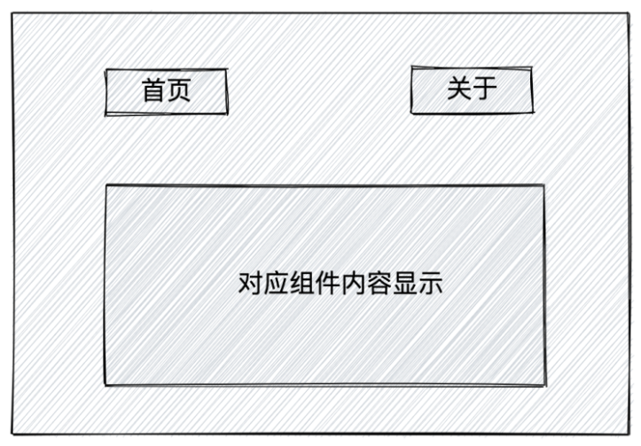

# 基础使用
需求:  准备俩个按钮，点击不同按钮切换不同组件内容的显示
### 实现步骤：
1. 导入必要的路由router内置组件
2. 准备俩个React组件
3. 按照路由的规则进行路由配置

```jsx
// 引入必要的内置组件
import { BrowserRouter, Routes, Route, Link } from 'react-router-dom'

// 准备俩个路由组件

const Home = () => <div>this is home</div>
const About = () => <div>this is about</div>

function App() {
  return (
    <div className="App">
      {/* 按照规则配置路由 */}
      <BrowserRouter>
        <Link to="/">首页</Link>
        <Link to="/about">关于</Link>
        <Routes>
          <Route path="/" element={<Home />}></Route>
          <Route path="/about" element={<About />}></Route>
        </Routes>
      </BrowserRouter>
    </div>
  )
}

export default App
```
## BrowerRouter
作用: 包裹整个应用，一个React应用只需要使用一次
| 模式 | 实现方式 | 路由url表现 |
| --- | ------- | ---------- |
| HashRouter | 监听url hash值实现 | `http://localhost:3000/#/about` |
| BrowerRouter | h5的 history.pushState API实现 | `http://localhost:3000/about` |

## Link
作用: 用于指定导航链接，完成声明式的路由跳转  类似于 `<router-link/>`
```jsx
// 这里to属性用于指定路由地址，表示要跳转到哪里去，Link组件最终会被渲染为原生的a链接
<Link to="/path">页面一</Link>
```
## Routes
作用: 提供一个路由出口，组件内部会存在多个内置的Route组件，满足条件的路由会被渲染到组件内部，
类比  `router-view`
```jsx
<Routes>
    {/* 满足条件的路由组件会渲染在这里 */}
    <Route path="/" element={<Home />}></Route>
    <Route path="/about" element={<About />}></Route>
</Routes>
```
## Route
作用: 用于定义路由路径和渲染组件的对应关系  [element：因为react体系内 把组件叫做react element]
```jsx
 <Route path="/about" element={<About />}></Route>
// 其中path属性用来指定匹配的路径地址，element属性指定要渲染的组件，
//图中配置的意思为: 当url上访问的地址为 /about 时，当前路由发生匹配，对应的About组件渲染
```
## 编程式导航

### 声明式 【 Link to】  vs  编程式 【调用路由方法进行路由跳转】
#### 概念:  通过js编程的方式进行路由页面跳转，比如说从首页跳转到关于页
##### 实现步骤：
1. 导入一个 useNavigate 钩子函数
2. 执行 useNavigate 函数 得到 跳转函数
3. 在事件中执行跳转函数完成路由跳转
```jsx
// 导入useNavigate函数
import { useNavigate } from 'react-router-dom'
const Home = () => {
  // 执行函数
  const navigate = useNavigate()
  return (
    <div>
      Home
      <button onClick={ ()=> navigate('/about') }> 跳转关于页 </button>
        {/* 
            如果在跳转时不想添加历史记录，可以添加额外参数replace 为true
            navigate('/about', { replace: true } )
         */}
    </div>
  )
}

export default Home
```
## 路由传参
场景：跳转路由的同时，有时候要需要传递参数
## 1. searchParams传参
```jsx
// 传参
navigate('/about?id=1001')
// 取参
import {searchParams} from 'react-router-dom'
let [params] = useSearchParams()
let id = params.get('id')
```
## 2. params传参
```jsx
// 传参
navigate('/about/1001')
// 取参
import {useParams} from 'react-router-dom'
let params = useParams()
let id = params.id
```
## 嵌套路由
场景：在我们做的很多的管理后台系统中，通常我们都会设计一个Layout组件，在它内部实现嵌套路由

### 实现步骤：
1. App.js中定义嵌套路由声明
```jsx
<Routes>
  <Route path="/"  element={<Layout/>}>
    <Route path="board" element={ <Board/> } />
    <Route path="article" element={ <Article/> } />
  </Route>
   { /* 省略部分  */ }
</Routes>
```
2. Layout组件内部通过 <Outlet/> 指定二级路由出口
```jsx
import { Outlet } from 'react-router-dom'

const Layout = () => {
  return (
    <div>
      layout
      { /* 二级路由的path等于 一级path + 二级path  */ }
      <Link to="/board">board</Link>
      <Link to="/article">article</Link>
      { /* 二级路由出口 */ }
      <Outlet/>
    </div>
  )
}
export default Layout
```
## 默认二级路由
场景: 应用首次渲染完毕就需要显示的二级路由
### 实现步骤:
1. 给默认二级路由标记index属性
2. 把原本的路径path属性去掉
```jsx
<Routes>
  <Route path="/"  element={<Layout/>}>
    <Route index element={ <Board/> } />
    <Route path="article" element={ <Article/> } />
  </Route>
</Routes>
```
## 404路由配置
场景：当url的路径在整个路由配置中都找不到对应的path，使用404兜底组件进行渲染
### 1- 准备一个NotFound组件
```jsx
const NotFound = () => {
  return <div>this is NotFound</div>
}

export default NotFound
```
```jsx
<BrowserRouter>
  <Routes>
    <Route path="/" element={<Layout />}>
      <Route index element={<Board />} />
      <Route path="article" element={<Article />} />
    </Route>
    <Route path="*" element={<NotFound />}></Route>
  </Routes>
</BrowserRouter>
```
## 集中式路由配置
场景: 当我们需要路由权限控制点时候, 对路由数组做一些权限的筛选过滤，所谓的集中式路由配置就是用一个数组统一把所有的路由对应关系写好替换 本来的Roues组件
```jsx
import { BrowserRouter, Routes, Route, useRoutes } from 'react-router-dom'
import { lazy, Suspense } from "react";
import Layout from './pages/Layout'
import NotFound from './pages/NotFound'
// 路由懒加载 必须搭配 Suspense 使用
const Board = lazy(()=>import('./pages/Board'))
const Article = lazy(()=>import('./pages/Board'))
const lazyLoad = (children): ReactNode => {
  return <Suspense fallback={<div>loading...</div>}>{children}</Suspense>;
};
// 1. 准备一个路由数组 数组中定义所有的路由对应关系
const routesList = [
  {
    path: "/",
    // 重定向
    element: <Navigate to="/home/article" />,
  },
  {
    path: '/home',
    element: <Layout />,
    children: [
      {
        element: lazyLoad(<Board />),
        index: true, // index设置为true 变成默认的二级路由
      },
      {
        path: 'article',
        element: lazyLoad(<Article />),
      },
    ],
  },
  // 增加n个路由对应关系
  {
    path: '*',
    element: <NotFound />,
  },
]

// 2. 使用useRoutes方法传入routesList生成Routes组件
function WrapperRoutes() {
  let element = useRoutes(routesList)
  return element
}

function App() {
  return (
    <div className="App">
      <BrowserRouter>
        {/* 3. 替换之前的Routes组件 */}
        <WrapperRoutes />
      </BrowserRouter>
    </div>
  )
}

export default App
```