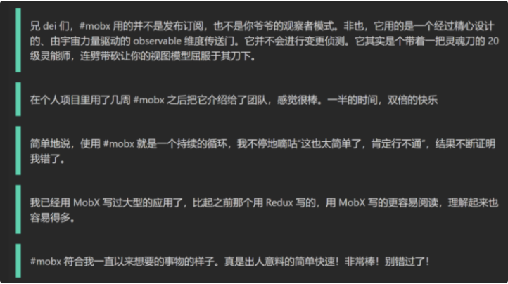
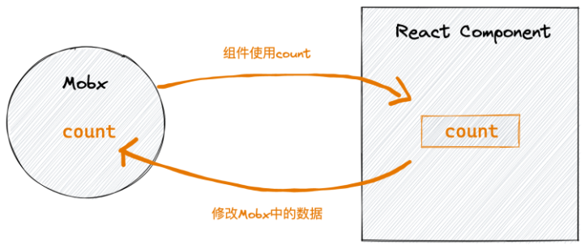
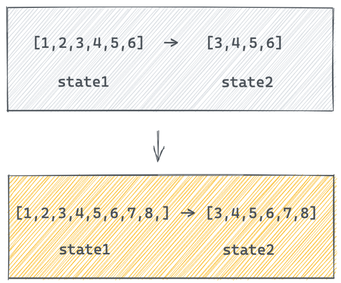
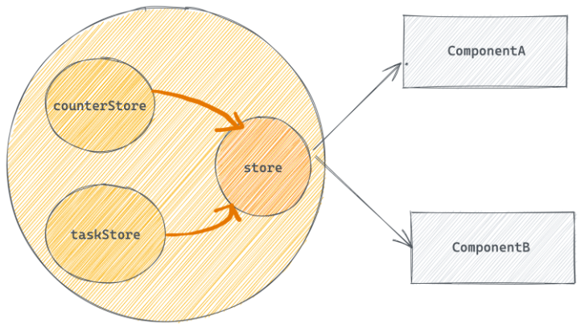
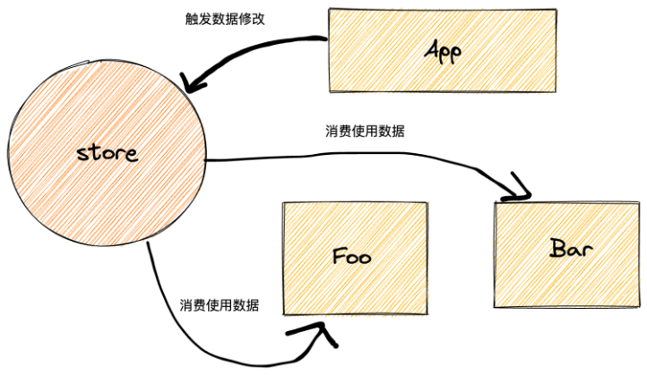

# Mobx
## Mobx介绍
一个可以和React良好配合的集中状态管理工具，和Redux解决的问题相似，都可以独立组件进行集中状态管理
## 优势
1. 简单
编写无模板的极简代码精准描述你的意图 
2. 轻松实现最优渲染
依赖自动追踪，实现最小渲染优化
3. 架构自由
可移植, 可测试 无特殊心智负担
## 社区评价

## 下载依赖
```js
// 安装mobx和中间件工具 mobx-react-lite  只能函数组件中使用
yarn add  mobx  mobx-react-lite
```
## 基础使用
需求: 使用mobx实现一个计数器的案例

## 1. 初始化mobx
### 初始化步骤
1. 定义数据状态state
2. 在构造器中实现数据响应式处理 makeAutoObservble
3. 定义修改数据的函数action
4. 实例化store并导出
```jsx
import { makeAutoObservable } from 'mobx'

class CounterStore {
  count = 0 // 定义数据
  constructor() {
    makeAutoObservable(this)  // 响应式处理
  }
  // 定义修改数据的方法
  addCount = () => {
    this.count++
  }
}

const counter = new CounterStore()
export default counter
```
## 2. React使用store
### 实现步骤
1. 在组件中导入counterStore实例对象
2. 在组件中使用storeStore实例对象中的数据
3. 通过事件调用修改数据的方法修改store中的数据
4. 让组件响应数据变化
```jsx
// 导入counterStore
import counterStore from './store'
// 导入observer方法
import { observer } from 'mobx-react-lite'
function App() {
  return (
    <div className="App">
      <button onClick={() => counterStore.addCount()}>
        {counterStore.count}
      </button>
    </div>
  )
}
// 包裹组件让视图响应数据变化
export default observer(App)
```
## 计算属性（衍生状态）
概念: 有一些状态根据现有的状态计算（衍生）得到，我们把这种状态叫做计算属性, 看下面的例子

### 实现步骤
1. 生命一个存在的数据
2. 通过get关键词 定义计算属性
3. 在 makeAutoObservable 方法中标记计算属性
```jsx
import { computed, makeAutoObservable } from 'mobx'

class CounterStore {
  list = [1, 2, 3, 4, 5, 6]
  constructor() {
    makeAutoObservable(this, {
      filterList: computed
    })
  }
  // 修改原数组
  changeList = () => {
    this.list.push(7, 8, 9)
  }
  // 定义计算属性
  get filterList () {
    return this.list.filter(item => item > 4)
  }
}

const counter = new CounterStore()

export default counter
```
```jsx
// 导入counterStore
import counterStore from './store'
// 导入observer方法
import { observer } from 'mobx-react-lite'
function App() {
  return (
    <div className="App">
      {/* 原数组 */}
      {JSON.stringify(counterStore.list)}
      {/* 计算属性 */}
      {JSON.stringify(counterStore.filterList)}
      <button onClick={() => counterStore.changeList()}>change list</button>
    </div>
  )
}
// 包裹组件让视图响应数据变化
export default observer(App)
```
## 异步数据处理
### 实现步骤:
1. 在mobx中编写异步请求方法 获取数据 存入state中
2. 组件中通过 useEffect + 空依赖  触发action函数的执行
```jsx
// 异步的获取

import { makeAutoObservable } from 'mobx'
import axios from 'axios'

class ChannelStore {
  channelList = []
  constructor() {
    makeAutoObservable(this)
  }
  // 只要调用这个方法 就可以从后端拿到数据并且存入channelList
  setChannelList = async () => {
    const res = await axios.get('http://geek.itheima.net/v1_0/channels')
    this.channelList = res.data.data.channels
  }
}
const channlStore = new ChannelStore()
export default channlStore
```
```jsx
import { useEffect } from 'react'
import { useStore } from './store'
import { observer } from 'mobx-react-lite'
function App() {
  const { channlStore } = useStore()
  // 1. 使用数据渲染组件
  // 2. 触发action函数发送异步请求
  useEffect(() => {
    channlStore.setChannelList()
  }, [])
  return (
    <ul>
      {channlStore.channelList.map((item) => (
        <li key={item.id}>{item.name}</li>
      ))}
    </ul>
  )
}
// 让组件可以响应数据的变化[也就是数据一变组件重新渲染]
export default observer(App)
```
## 模块化
场景: 一个项目有很多的业务模块，我们不能把所有的代码都写到一起，这样不好维护，提了提供可维护性，需要引入模块化机制

### 1- 定义task模块
```jsx
import { makeAutoObservable } from 'mobx'

class TaskStore {
  taskList = []
  constructor() {
    makeAutoObservable(this)
  }
  addTask () {
    this.taskList.push('vue', 'react')
  }
}

const task = new TaskStore()


export default task
```
### 2- 定义counterStore
```jsx
import { makeAutoObservable } from 'mobx'

class CounterStore {
  count = 0
  list = [1, 2, 3, 4, 5, 6]
  constructor() {
    makeAutoObservable(this)
  }
  addCount = () => {
    this.count++
  }
  changeList = () => {
    this.list.push(7, 8, 9)
  }
  get filterList () {
    return this.list.filter(item => item > 4)
  }
}

const counter = new CounterStore()

export default counter
```
### 3- 组合模块导出统一方法
```jsx
import React from 'react'

import counter from './counterStore'
import task from './taskStore'


class RootStore {
  constructor() {
    this.counterStore = counter
    this.taskStore = task
  }
}


const rootStore = new RootStore()

// context机制的数据查找链  Provider如果找不到 就找createContext方法执行时传入的参数
const context = React.createContext(rootStore)

const useStore = () => React.useContext(context)
// useStore() =>  rootStore  { counterStore, taskStore }

export { useStore }
```
### 4- 组件使用模块中的数据
```jsx
import { observer } from 'mobx-react-lite'
// 导入方法
import { useStore } from './store'
function App() {
  // 得到store
  const store = useStore()
  return (
    <div className="App">
      <button onClick={() => store.counterStore.addCount()}>
        {store.counterStore.count}
      </button>
    </div>
  )
}
// 包裹组件让视图响应数据变化
export default observer(App)
```
## 多组件共享数据
目标：当数据发生变化 所有用到数据的组件都会得到同步的组件的更新

实现步骤：在Foo组件和Bar组件中分别使用store中的数据，然后在app组件中进行数据修改，查看Foo组件和Bar组件是否得到更新

```jsx
// 用taskStore中的taskList数据
import { useStore } from './store'
import { observer } from 'mobx-react-lite'
const Bar = () => {
  const { taskStore } = useStore()
  return (
    <ul>
      {taskStore.taskList.map((item) => (
        <li>{item}</li>
      ))}
    </ul>
  )
}

export default observer(Son)
```
```jsx
// 用taskStore中的taskList数据
import { useStore } from './store'
import { observer } from 'mobx-react-lite'
const Bar = () => {
  const { taskStore } = useStore()
  return (
    <ul>
      {taskStore.taskList.map((item) => (
        <li>{item}</li>
      ))}
    </ul>
  )
}

export default observer(Son)
```
```jsx
import Bar from './Bar'
import Foo from './Foo'
import { useStore } from './store'
function App() {
  const { taskStore } = useStore()
  return (
    <div className="App">
      <Bar />
      <button onClick={() => taskStore.setTaskList('angular')}>
        修改taskStore
      </button>
    </div>
  )
}
export default App
```