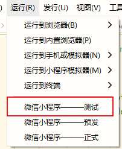
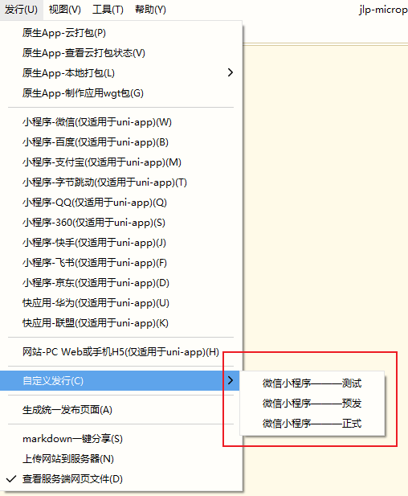

# 小程序多环境配置

## 概述

- 在开发 web 时，有时需要一套代码编译发布到不同的站点，比如主站和微信 h5 站。
- 在开发小程序时，经常有扩展小程序平台，比如基于阿里小程序的钉钉小程序、淘宝小程序。
- 在开发中，需要区分多个环境，如测试、预发和正式环境等

## 开发环境和生产环境

- 小程序运行时为`development`，发行时为`production`

```js
if (process.env.NODE_ENV === "development") {
  console.log("开发环境");
} else {
  console.log("生产环境");
}
```

## 配置环境

```json
{
  /**
   * package.json其它原有配置
   */
  "uni-app": {
    // 扩展配置
    "scripts": {
      "dev": {
        //自定义编译平台配置，可通过cli方式调用
        "title": "微信小程序——测试", // 在HBuilderX中会显示在 运行/发行 菜单中
        "browser": "", //运行到的目标浏览器，仅当UNI_PLATFORM为h5时有效
        "env": {
          //环境变量
          "UNI_PLATFORM": "", //基准平台
          "VUE_APP_BASE_URL": "https://dev.com" // ... 其他自定义环境变量
        },
        "define": {
          //自定义条件编译
          "CUSTOM-CONST": true //自定义条件编译常量，建议为大写
        }
      }
    }
  }
}
```

配置之后就可以通过`process.env`进行环境变量获取，如`process.env.VUE_APP_BASE_URL`

```js
console.log(process.env.VUE_APP_BASE_URL);
// https://dev.com
```

:::warning 注意
拷贝代码后请去掉注释！有注释会运行失败！！！
:::

- `UNI_PLATFORM` 仅支持填写`uni-app`默认支持的基准平台，目前仅限如下枚举值：`h5`、`mp-weixin`、`mp-alipay`、`mp-baidu`、`mp-toutiao`、`mp-qq`
- `browser` 仅在 `UNI_PLATFORM` 为 `h5` 时有效,目前仅限如下枚举值：`chrome`、`firefox`、`ie`、`edge`、`safari`、`hbuilderx`
- `package.json`文件中不允许出现注释，否则扩展配置无效
- `vue-cli`需更新到最新版，`HBuilderX`需升级到 `2.1.6+` 版本

## 条件编译

- 在指定的环境下才会触发对应的代码

```js
// #ifdef MP
小程序平台通用代码（含钉钉）
// #endif

// #ifdef MP-ALIPAY
支付宝平台通用代码（含钉钉）
// #endif

// #ifdef MP-DINGTALK
钉钉平台特有代码
// #endif

// #ifdef CUSTOM-CONST
自定义条件编译
// #endif
```

## 运行



## 发布


