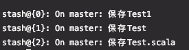

# git stash

什么？居然还有人不知道 `git stash`，这么好用的东西还有人不会，我不允许！！！

## 介绍

`git` 是日常开发中版本控制必不可少的工具，当遇到代码重构或者临时恢复时，`git stash` 的隐藏功能非常好用，其主要应用于下述场景：

上线功能开发中需要切换分支或者切回老版本，但是不想 commit 和丢弃当前改动，执行 `git stash` 功能会将当前改动存储至后台，当需要恢复时，执行 `git stash pop` 即可，可以理解为一个保存栈。

## git stash

将当前的改动保存下来，默认保存是没有标识的。

```bash
git stash
```

## git stash save $info

`$info` 填写备注标识，这样就可以明确的知道每次隐藏的是什么内容。

```bash
git stash save '更改了用户信息'
```

## git stash list

查看所有隐藏的记录

```bash
git stash list
```

列举如下：


## git stash pop

弹出最新 `stash` 的内容，并删除该 `stash`，类似于栈的 `pop` 即弹出并删除

```bash
# 取出最新的一条
git stash pop
# 也可以根据编号来弹出
git stash pop 1
```

## git stash show

显示当前最新 `stash` 的改动，主要是恢复 `stash` 前可以看到修改内容，如果忘了 `stash` 了什么内容可以使用

```bash
# 查看最新的一条改动
git stash show
# 查看指定的某条改动
git stash show 1
```

## git stash drop

删除 `stash` 记录

```bash
# 删除最新的一条改动
git stash drop
# 删除指定的某条改动
git stash drop 1
```

## git stash clear

删除所有 `stash` 记录

```bash
git stash clear
```

## 友情提示

:::tip
使用 `git stash` 必须先进行 `git add` 操作
:::
