# svn使用详解
## （Checkout）检出操作
- 链接到SVN服务器端 

- 拉取服务端数据到本地

注意：Checkout只在第一次链接时操作一次，以后如果进行更新操作请使用Update（更新指令）
## （Commit）提交操作
将本地修改的代码提交到远程
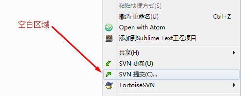
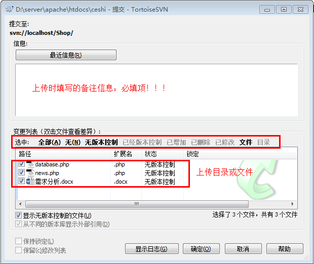
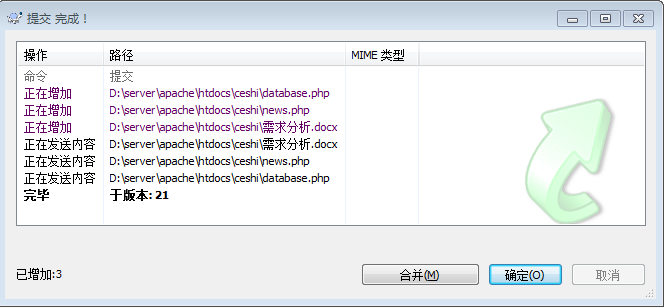
## （Update更新操作）
将远程修改的代码更新到本地
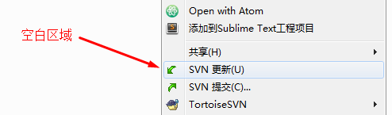

## 忽略功能
有些文件不希望上传至svn服务器，应该将该文件或该类型的文件添加至忽略列表
1. 忽略某个指定的文件
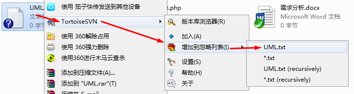
2. 忽略某类型文件
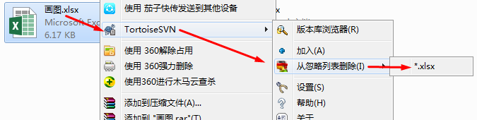

## 版本回退
有些时候，软件的运行可能使开发者或使用者不满意，这时我们需要把当前版本退回到以前的某个版本。
1. 在项目空白处鼠标右键，采用如下图所示操作
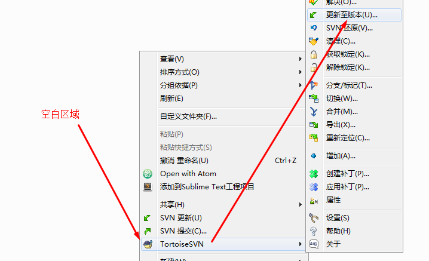
2. 根据日志或者版本号进行版本回退
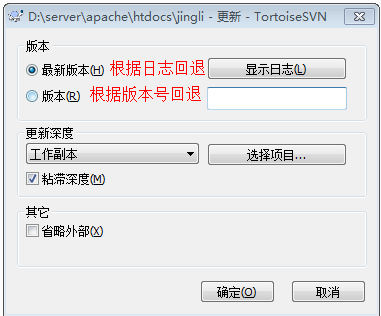
3. 根据日志信息选择要回退的状态，点击确定即可
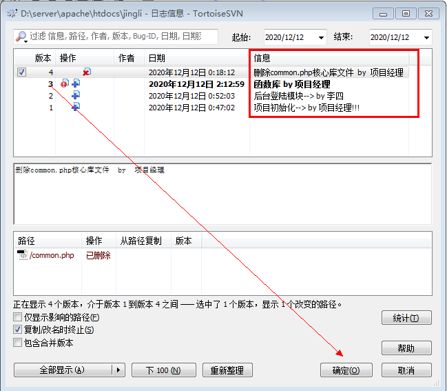

## 版本冲突
在实际项目开发中，如果两个人同时修改某个文件就会产生版本冲突问题。

点击commit的时候发现如下错误，有冲突，禁止提交
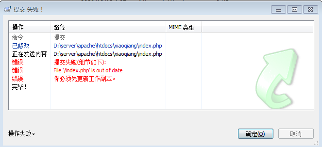

### 解决方案
1. update远程代码到本地
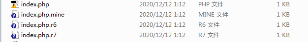
- index.php ：整合后的index.php冲突文件
- index.php.mine ：本地修改后的index.php文件
- index.php.r6 ：index.php的起始文件（最初的）
- index.php.r7 ：另外一位同事修改后的index.php文件
2. 删除其他index.php文件，只保留整合后的index.php
- 打开index.php文件，手动将冲突解决
- 解决之后重新commit即可