# 什么是 SVN

- SVN 全称 SubVersion
- SVN 是近年来崛起的版本管理工具，是 CVS 的接班人。目前，绝大多数软件公司都使用 SVN 作为代码版本管理软件。

## 特点

- 操作简单，入门容易
- 支持跨平台（Window/Linux/MacOS)
- 支持版本回退功能（时间机器）

## 获取 SVN 软件

属于 C/S 结构软件（客户端与服务器端）

服务端软件：[VisualSVN](https://gitee.com/mao-118/utools-filebed/raw/master/svn/VisualSVN-Server-2.7.7.msi)

客户端软件：TortoiseSVN

[win64](https://gitee.com/mao-118/utools-filebed/raw/master/svn/TortoiseSVN-1.8.10.26129-x64-svn-1.8.11.msi)

[win64 中文包](https://gitee.com/mao-118/utools-filebed/raw/master/svn/LanguagePack_1.8.10.26129-x64-zh_CN.msi)

[win32](https://gitee.com/mao-118/utools-filebed/raw/master/svn/TortoiseSVN-1.8.10.26129-win32-svn-1.8.11.msi)

[win32 中文包](https://gitee.com/mao-118/utools-filebed/raw/master/svn/LanguagePack_1.8.10.26129-win32-zh_CN.msi)

点击下一步直至安装结束即可。

## 服务端配置

### 一、创建版本仓库

1. 首先在 SVN 服务器端创建一个公有目录 WebApp 做为项目目录

2. 在 WebApp 目录下创建 Shop 文件夹，做为 Shop（版本仓库）
   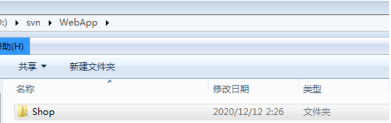

3. 创建版本仓库，基本语法：

svnadmin create Shop 文件夹路径（Shop 仓库）
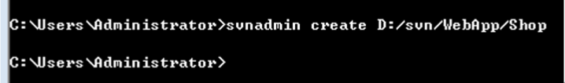

如果 Shop 仓库配置成功，那么 Shop 文件夹会显示以下目录结构
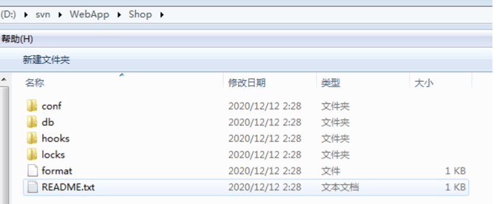

### 二、启动服务端

基本语法：
svnserve -d（后台运行） -r（监管目录） 版本仓库目录
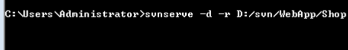
通过以上指令，我们的 `svn://localhost` 或 ip 地址就可以直接指向 Shop 版本仓库

### 三、客户端连接

Apache `http://localhost` 或(ip 地址)访问到 htdocs 目录下的相关文件（监管）

SVN `svn://localhost` 或(ip 地址)访问到相关数据仓库（如 Shop 仓库）

- 如果有多个项目的话，`svnserve`可以启动项目的父目录，客户端连接的时候只需要带上项目的文件路径即可
- 如`http://localhost/Shop`

### 四、权限控制

#### 匿名用户权限控制

默认情况下，SVN 服务器是不允许匿名用户上传文件到服务器端的，所以必须更改系统相关配置文件。
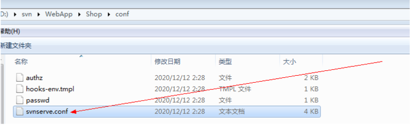
更改第 19 行代码，去除前面的空格以及#号，更改其值为 write（可读写）
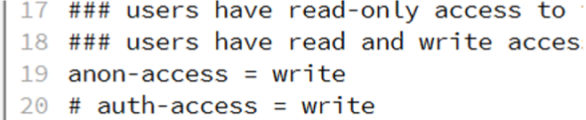

#### 账号权限控制

1. 关闭匿名用户权限控制 `svnserve.conf`文件
   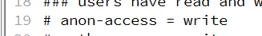
2. 开启 `authz`文件和`passwd`文件
   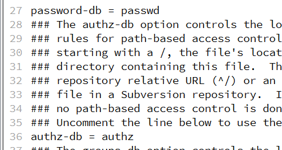
3. 编写`passwd`文件相关用户名与密码
   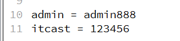
4. 编写`authz`授权文件

   - 设置 groups 组
     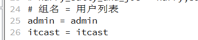
   - 给 groups 设置权限
     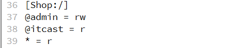
     :::tip
     组中如有多个用户用逗号分开，如：admin = admin,root

     r：可读

     w：可写

     \*：其他所有用户
     :::

5. 配置成功后重新拉取或提交文件需要用户登录
   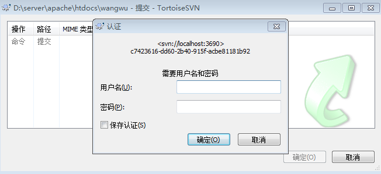

## svn 客户端软件连接 SVN 服务器

### 1. Checkout 检出

首先在你的项目目录鼠标右键 TortoiseSVN 版本库浏览器输出 SVN 服务器地址：
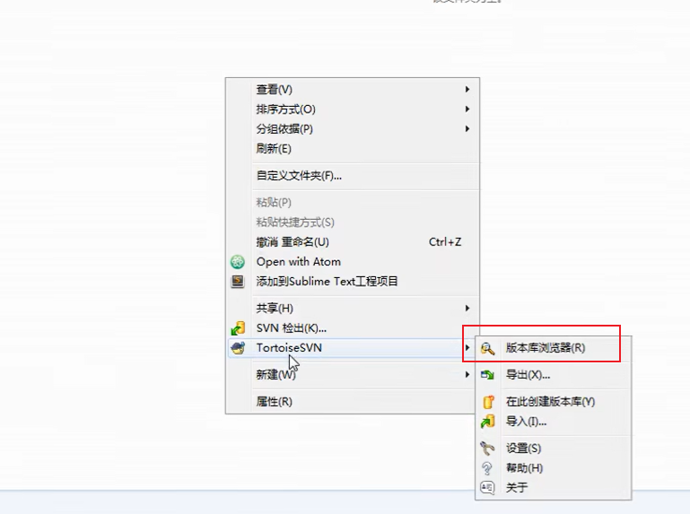
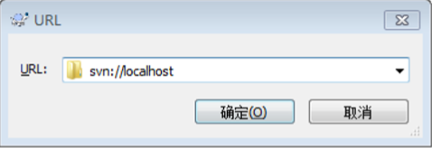
svn://SVN 服务器地址  Shop 项目（仓库）
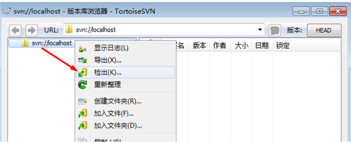
检出成功之后该目录下会多出一个.svn 隐藏文件，代表检出成功
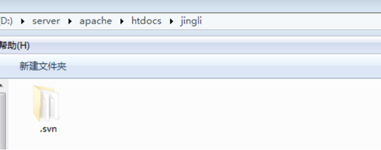
