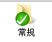
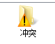
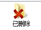
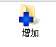
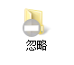

# svn图标集
## 常规图标

含义：当客户端文件与服务器端文件完全同步时，系统会显示以上图标
## 冲突图标

含义：当客户端提交的文件与服务器端数据有冲突，系统会显示以上图标
## 删除图标

含义：当服务端数据已删除，那么客户端该文件将显示以上图标

## 增加图标

含义：当我们编写文档已添加到提交队列，那么系统将自动显示以上图标
## 无版本控制图标

含义：当我们编写的文件没有添加到上传队列，系统将自动显示以上图标
## 修改图标

含义：当客户端文件有修改但未提交，此时将自动显示以上图标
## 只读图标

含义：当客户端文件以只读形式存在时，将自动显示以上图标
## 锁定图标

含义：当服务端数据已锁定，那么客户端文件将自动显示以上图标
## 忽略图标

含义：客户端文件已忽略，不需要进行提交上传，那么将自动显示以上图标