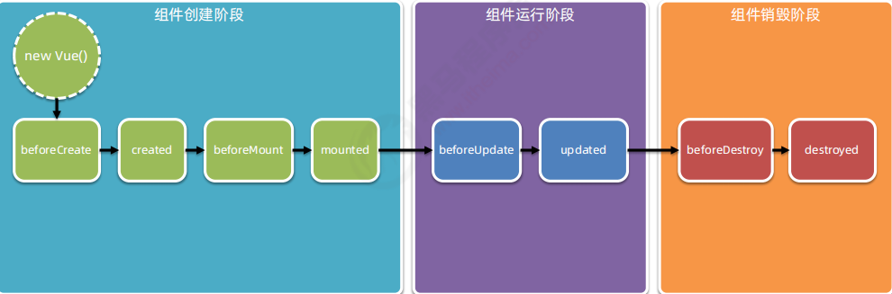

# 生命周期
生命周期（Life Cycle）是指一个组件从创建 -> 运行 -> 销毁的整个阶段，强调的是一个时间段。

生命周期函数：是由 vue 框架提供的内置函数，会伴随着组件的生命周期，自动按次序执行。

注意：生命周期强调的是时间段，生命周期函数强调的是时间点。

## 常用的钩子函数

| beforeCreate  | 在实例初始化之后，数据观测和事件配置之前被调用 此时data 和 methods 以及页面的DOM结构都没有初始化   什么都做不了 |
| ------------- | ------------------------------------------------------------ |
| created       | 在实例创建完成后被立即调用此时data 和 methods已经可以使用  但是页面还没有渲染出来 |
| beforeMount   | 在挂载开始之前被调用   此时页面上还看不到真实数据 只是一个模板页面而已 |
| mounted       | el被新创建的vm.$el替换，并挂载到实例上去之后调用该钩子。  数据已经真实渲染到页面上  在这个钩子函数里面我们可以使用一些第三方的插件 |
| beforeUpdate  | 数据更新时调用，发生在虚拟DOM打补丁之前。   页面上数据还是旧的 |
| updated       | 由于数据更改导致的虚拟DOM重新渲染和打补丁，在这之后会调用该钩子。 页面上数据已经替换成最新的 |
| beforeDestroy | 实例销毁之前调用                                             |
| destroyed     | 实例销毁后调用   