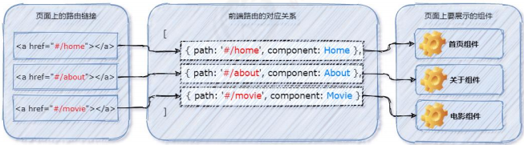

# 前端路由的概念与原理
## 什么是路由？

路由（英文：router）就是对应关系。
## SPA
SPA 指的是一个 web 网站只有唯一的一个 HTML 页面，所有组件的展示与切换都在这唯一的一个页面内完成。此时，不同组件之间的切换需要通过前端路由来实现。

结论：在 SPA 项目中，不同功能之间的切换，要依赖于前端路由来完成！
## 前端路由
通俗易懂的概念：Hash 地址与组件之间的对应关系。
## 前端路由的工作方式
- 用户点击了页面上的路由链接
- 导致了 URL 地址栏中的 Hash 值发生了变化
- 前端路由监听了到 Hash 地址的变化
- 前端路由把当前 Hash 地址对应的组件渲染都浏览器中

结论：前端路由，指的是 Hash 地址与组件之间的对应关系！
## 实现简易的前端路由
```vue
<template>
<!-- <a> 链接添加对应的 hash 值： -->
    <a href="#/home">Home</a>
    <a href="#/about">About</a>
<!--通过 <component> 标签，结合 组件名 动态渲染组件。-->
    <component :is="comName"></component>

</template>
<script>
export default{
    data(){
        return{
            comName:'Home'
        }
    },
    created(){
        // 在 created 生命周期函数中，
        //监听浏览器地址栏中 hash 地址的变化，
        //动态切换要展示的组件的名称
      window.onhanshchange=()=>{
        switch(location.hash){
            case '#/home':
                this.comName = 'Home'
                break
            case '#/about':
                this.comName = 'About'
                break
        }
      }
    }
}
</script>
```